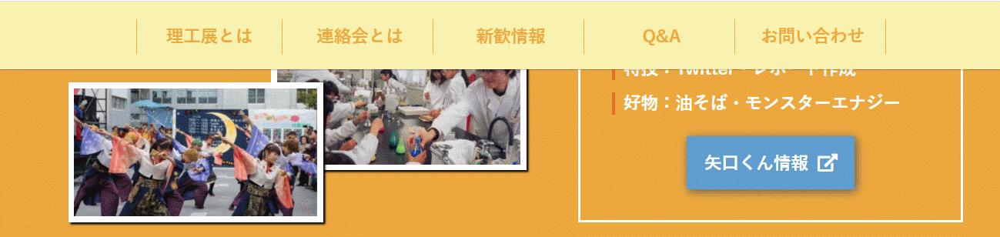
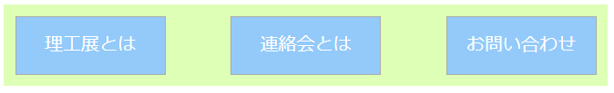

# CSS概要
HTML5＆CSS3標準デザイン講座/草野あけみ/翔泳社  
を参考に作成

- [0 CSSってなんだろう？](#0)
- [1 CSSの基本](#1)
  - [1-1 CSSをHTMLに組み込み方法](#1-1)
  - [1-2 CSSの基本書式](#1-2)
  - [1-3 セレクタの種類](#1-3)
  - [1-4 セレクタの詳細度](#1-4)
  - [1-5 `div`要素と`span`要素](#1-5)
- [2 デベロッパーツール](#2)
- [3 各種プロパティ](#3)
  - [3-1 重要だが詳しく取り上げる必要のないプロパティ一覧](#3-1)
  - [3-2 重要プロパティ①　`border` / `padding` / `margin`](#3-2)
  - [3-3 重要プロパティ②　`display`](#3-3)
  - [3-4 重要プロパティ③　`position`](#3-4)
  - [3-5 重要プロパティ④　`flex`](#3-5)
- [4 疑似クラス](#4)
- [5 疑似要素](#5)

**Column**
- [C-1　デベロッパーツールの使い方](#c-1)
- [C-2　テキストの上下左右中央揃え](#c-2)

## 0　CSSってなんだろう？　<a id="0"></a>

これまでHTMLを学んで文書をマークアップする方法を学んできました。タグで囲むことで文字が大きくなったり改行されたりしました。ところが、実際にあのようなwebページというのはほとんどないですよね。もっと色がついていたり、見やすく整形されていたり、マウスで触れたら動くような効果がついている場合もあります。CSSはこのようなwebページの見た目を整えるためのものです。具体的には以下のようなことが実現できます。

- 文字組の整形（文字サイズ、文字スタイル、行間・文字間、字下げ、行揃えなど）
- 色の変更（前景色、背景色）
- レイアウトの調整（ボックスサイズ、余白、段組みなど）
- 要素の装飾（影、角丸、グラデーション、背景画像の貼り付けなど）
- 要素の変形（拡大縮小・回転・傾斜・反転など）
- アニメーション効果（トランジション効果・キーフレームアニメーション）　　など

## 1　CSSの基本　<a id="1"></a>

### 1-1　CSSをHTMLに組み込む方法　<a id="1-1"></a>

CSSをHTMLに適用させる方法は3種類ありますが基本的には外部参照という方法をとります。他の方法も一応紹介はしておきます。

#### 外部参照

外部参照する場合はhtmlファイルとは別にCSSファイルを作り、`<head>`の中に`<link>`タグを使って参照します。`head`要素を覚えているでしょうか？`body`要素の上に書かれていたやつですね。ここに関してはとくに知らなくても大丈夫なんですが、CSSを外部参照するときにここに書き込むということだけ知っておきましょう。

```html
<!-- html -->
<head>
  <link href = "外部CSSファイルへのパス" rel = "stylesheet" media = "all">
</head>
```
ハイパーリンクの時と同様に`href`属性が出てきました。ここにCSSファイルへのパスを入れましょう。他の属性に関してはこう書いておけば大丈夫です。

#### 内部参照

```html
<!-- html -->
<style>
  h1 {color: #a1a1a1;}
</style>
```
htmlファイルの中に`<style>`タグを書き込んでその中にCSSを直接書く方法です。

#### インライン

```html
<!-- html -->
<h1 style = "color: #a1a1a1;">見出し</h1>
```
タグに`style`属性を用いて直接CSSを適用させる方法です。この方法は原則使用しないようにしましょう。

### 1-2　CSSの基本書式　<a id="1-2"></a>

CSSの基本書式は、セレクタでCSSを適用させる場所を示し、プロパティと値でどの属性をどのような値にするのか決定します。


例として上のように書くと、`h1`（見出し要素）の`color`（色）を`#A1A1A1`にするという意味になります。`#A1A1A1`とは16進数の色コードです。webページの作成においては16進数の色コードおよびRGB指定が良く使われます。では、ここでCSSを適用させる場所指定をするセレクタについて深堀りして行きましょう。ここはかなり大事なところですよ。

### 1-3　セレクタの種類　<a id="1-3"></a>

セレクタの種類は基本的に3種類あります。

#### タイプセレクタ

```html
<!-- html -->
<h1>見出し</h1>
<p>段落</p>
```

```css
/* css */
h1 {
  color: #A1A1A1;
}

p {
  background-color: red;
}
```

今まで習ってきた要素名をセレクタにする方法です。

#### idセレクタ

```html
<!-- html -->
<h1 id = "foo">見出し</h1>
<p id = "bar">段落</p>
```

```css
/* css */
#foo {
  color: #A1A1A1;
}

#bar {
  background-color: red;
}
```

開始タグに`id`属性を書き足して任意の名前を付け（ここでは`foo`および`bar`）、その名前の先頭に`#`をつけることでセレクタ名とする方法です。ただし、`id`属性の名前はページの中で固有のものでなければいけません。つまり同じ`id`属性名がついた要素が2つ以上存在していてはダメということです。

#### classセレクタ

```html
<!-- html -->
<h1 class = "baz">見出し</h1>
<p class = "qux">段落</p>
```

```css
/* css */
.baz {
  color: #A1A1A1;
}

.qux {
  background-color: red;
}
```

開始タグに`class`属性を書き足して任意の名前を付け（ここでは`baz`および`qux`）、その名前の先頭に`.`をつけることでセレクタ名とする方法です。

<small>※ここで例として挙げた`id`属性名および`class`属性名はメタ構文変数と呼ばれ、サンプルプログラムなどで意味のない名前が必要な場合に利用されるものです。実際に`id`属性名や`class`属性名を自分でつけるときは、その属性名がどういう意味を示しているのか分かるように名前を付けるのが好ましいので覚えておきましょう。</small>

以上からセレクタには3種類あることが分かりました。ではこれらをどうやって使い分ければいいのでしょうか？まずはタイプセレクタとidおよびclassセレクタの使い分けから説明します。以下の例を見てみましょう。

```html
<!-- html -->
<h1>見出し1</h1>
<h1>見出し2</h1>
```

見出しが二つありますね。ここで最初の見出しの色だけ赤くしたいと思って以下のようにCSSを書くとどうなるでしょうか？

```css
/* css */
h1 {
  color: red;
}
```

当然どちらも`h1`要素なのですから、両方赤文字になってしまいますね。このように同じ要素に違う効果をつけたい場合はタイプセレクタは使えないのです。逆に言えば、同じ要素全てに同様の効果を与えたい場合はタイプセレクタが便利ということになります。ではidセレクタとclassセレクタはどのように使い分ければいいのでしょうか？とりあえずclassセレクタを用いて最初の見出しだけ赤くしてみましょう。

```html
<!-- html -->
<h1 class = "class-first-h1">見出し1</h1>
<h1>見出し2</h1>
```

```css
/* css */
.class-first-h1 {
  color: red;
}
```

こんな感じですね。ではidセレクタを用いて実装したらどうなりますか？

```html
<!-- html -->
<h1 id = "id-first-h1">見出し1</h1>
<h1>見出し2</h1>
```

```css
/* css */
#id-first-h1 {
  color: red;
}
```

どちらもまったく同じように最初の`h1`要素のみが赤くなります。ではいよいよ本題。idとクラスで相反することを書いてみましょう。

```html
<!-- html -->
<h1 class = "class-first-h1" id = "id-first-h1">見出し1</h1>
<h1>見出し2</h1>
```

```css
/* css */
.class-first-h1 {
  color: black;
}

#id-first-h1 {
  color: red;
}
```

classセレクタでは文字を黒くしろと言い、idセレクタでは反対に赤くしろと言ってみると文字は赤くなります。つまり、セレクタには優先順位（正確には詳細度と言う）というものがあってclassセレクタよりもidセレクタの方が優先度が高いということが言えます。この詳細度というのがとても厄介で全部説明するのは大変です。かいつまんで説明していきます。

おっと、本題を忘れていました。idセレクタとclassセレクタの使い分けですが、idセレクタには重要なルールがありました。同じhtmlファイルに一回しか同じid名を付けてはいけないというルールです。1つの要素にしか適用できないわけですから自然と使われる場所は限られてきますよね。その程度の理解で大丈夫です。もちろん詳細度がclassセレクタよりも高いことからCSSの上書き用として使用されることもありますが、基本的には特別（特異）なものに使用するとだけ覚えておいてclassセレクタを主に使いましょう。（JavaScript等を学ぶとidセレクタも重要になってきたりするのですがそれはまだ先の話です）


### 1-4　セレクタの詳細度　<a id="1-4"></a>

**ルール**
1. 後から記述されたもの優先
2. タグ < クラス < id　の順に優先度が上がる
3. 外部参照 < 内部参照 < インライン指定の順に優先度が上がる
4. 子孫セレクタ等でセレクタが複数になっている場合はより詳しく指定されている方が優先される

#### 1.　後から記述されたもの優先

今まで言及してきませんでしたが、同じCSSファイルに同じタイプセレクタやclassセレクタ、idセレクタを書くことができます。例えば下のような感じですね。

```css
/* css */
.foo {
  background-color: blue;
  color: black;
}

.foo {
  color: red;
}
```

こういった場合、プロパティが同じ場合は後に記述されたもので上書きされます。プロパティとはここでいう`background-color`（背景色）や`color`（文字色）のことでしたね。つまり上のように書くと、`foo`クラスが適用された要素は、背景色が青色、文字色は赤色になるということです。

#### 2.　タグ < クラス < id　の順に優先度が上がる

これは先ほど説明したとおりですね。タグとはタイプセレクタのことです。

#### 3.　外部参照 < 内部参照 < インライン指定の順に優先度が上がる

基本的には外部参照のみを使うので重要ではないですが一応このようなルールがあります。

#### 4.　子孫セレクタ等でセレクタが複数になっている場合はより詳しく指定されている方が優先される

セレクタって実は3種類ではありません。先に説明したセレクタを組み合わせて書くことができるのです。少しだけ説明しておきましょう。

##### グループセレクタ

以下のように複数のセレクタを`,`（カンマ）で繋ぐことで一括指定できます。

```css
/* css */
h1, h2, h3 {
  color: black;
}

.foo, #bar, h1 {
  color: red;
}
```

##### 子孫セレクタ

要素の親子関係を利用して、親要素から子要素へ絞り込む形で選択するセレクタです。親要素から順に半角スペースで区切って記述します。

```html
<!-- html -->
<div class = "menu">
  <ul>
    <li>箇条書き1</li>
    <li>箇条書き2</li>
  </ul>
</div>
```

```css
/* css */
.menu ul li {
  color: red;
}
```

上の例では`menu`クラスの要素の子要素である`ul`要素の子要素である`li`要素の文字色が赤になります。こういった指定方法ですから、例えば下のように`menu`クラスのタグ名が`div`から`nav`に変わっていたり、`div`要素が追加されていたとしても、`menu`クラスの子要素として`ul`要素が存在していることに変わりはありませんからまったく同じように`li`要素の文字色が赤くなります。

```html
<!-- html -->
<nav class = "menu">
  <div>
    <ul>
      <li>箇条書き1</li>
      <li>箇条書き2</li>
    </ul>
  </div>
</nav>
```

##### 子セレクタ

要素の親子関係を利用して直下の子要素のみを選択するセレクタです。前述した子孫セレクタでは子要素も孫要素もすべてに影響するのに対し、子セレクタは指定した要素の直下の子要素のみを選択する点で異なります。

```html
<!-- html -->
<div class = "menu">
  <ul>
    <li>箇条書き1</li>
    <li>箇条書き2</li>
  </ul>
</div>
```

```css
/* css */
.menu > ul > li {
  color: red;
}
```

上のように書けば`li`要素の文字色が赤くなります。ところが子孫セレクタと違って先ほどと同じ下のhtmlでは`li`要素の文字色は赤くなりません。なぜなら、`menu`クラスの直下の子要素には`div`要素しかなく、`ul`要素はないからです。

```html
<!-- html -->
<nav class = "menu">
  <div>
    <ul>
      <li>箇条書き1</li>
      <li>箇条書き2</li>
    </ul>
  </div>
</nav>
```

---

では話を戻して、"子孫セレクタ等でセレクタが複数になっている場合はより詳しく指定されている方が優先される"とはどういうことでしょうか。例えば以下のようにCSSを記述したとします。

```html
<!-- html -->
<div class = "menu">
  <ul>
    <li>箇条書き1</li>
    <li>箇条書き2</li>
  </ul>
</div>
```

```css
/* css */
.menu ul {
 color: blue;
}
.menu ul li {
  color: red;
}
```

すると、最初の記述で`menu`クラスの`ul`要素では文字色を青にするように指定しています。通常ならその子要素である`li`要素の文字色は青色になります。ところがその下の記述で、`menu`クラスの`ul`要素の中のさらに`li`要素の文字色を赤にするとさらに詳しく指定されているので、実際にはこちらの記述が優先されて文字色は赤色になります。

実際にはセレクタの種類はもう少しだけありますが、ほとんど使用されないのでここまで理解できていればとりあえず十分でしょう。


### 1-5　`div`要素と`span`要素　<a id="1-5"></a>

ここで今まで後回しにしてきた`div`要素と`span`要素について説明をしましょう。`div`要素はブロック要素、`span`要素はインライン要素という違いがありますが、どちらも任意の範囲に用いる要素であって、タグで囲むことで意味付けが発生するものではありません。ではこれらのタグがなぜ用意されているのかというと、主にCSSを適用させる範囲を指定する目的で使われます。実際に例を見てみましょう。

```html
<!-- html -->
<h3>セレクタの種類</h3>

<!-- ここから下の背景色をオレンジにしたい -->

<p>セレクタには主に3種類あります。</p>

<ul>
  <li>タイプセレクタ</li>
  <li>idセレクタ</li>
  <li>classセレクタ</li>
</ul>

<p>セレクタにはこれら3種類以外にもいくつかの種類があります</p>
```

このような文章において、見出しの”セレクタの種類”以外の部分の背景をオレンジ色にしたいとします。そのような場合、ここに書かれている全ての`p`タグや`ul`タグに対してクラスを設定して背景色を変えるのは大変ですし、文章がもっと長かったらなおさらです。このような場合に、背景色を変えたい部分全体を`div`で囲ってしまって、この`div`に対して背景色を指定してあげれば一回の記述で済みそうですよね。実際に書いたものが以下の通りです。

```html
<!-- html -->
<h3>セレクタの種類</h3>

<div class = "selector-desc">

  <p>セレクタには主に3種類あります。</p>

  <ul>
    <li>タイプセレクタ</li>
    <li>idセレクタ</li>
    <li>classセレクタ</li>
  </ul>

  <p>セレクタにはこれら3種類以外にもいくつかの種類があります</p>

</div>
```
```css
/* css */
.selector-desc {
  background-color: orange;
}
```

ここで、`p`タグや`ul`タグなどを囲った意味は特にないですよね。しいて言えばCSSのためです。このようにCSSのために囲うタグとして`div`要素が用意されているというわけですね。`span`要素も同様ですが、こちらはインライン要素という点で`div`とは使い方が少し違います。再度例を挙げてみます。

```html
<!-- html -->
<h3>セレクタの種類</h3>
```

ここで、この見出しの"セレクタ"という部分だけ文字色をオレンジにしようとしてみましょう。この場合"セレクタ"という文字を何らかのタグで囲わない限り、この部分だけ文字色を変更するのは不可能でしょう。このような場合にインライン要素である`span`要素を用いて"セレクタ"を囲ってあげることで文字色の変更を実現できます。因みに、ブロック要素の`div`等で囲むと改行されていしまいますので不適切です（ブロック要素とインライン要素の違いに、囲ったときに改行されるかされないかというのがありましたよね）。実際に記述したものが以下です。

```html
<!-- html -->
<h3><span class = "selector">セレクタ</span>の種類</h3>
```
```css
/* css */
.selector {
  color: orange;
}
```

## 2　デベロッパーツール　<a id="2"></a>

具体的なプロパティの紹介に移る前にデベロッパーツールなるものを紹介しておきます。Web制作をしているとよく予期しない結果になることがあります。上手くいくと思ってコードを書いてみたものの、実際に表示させてみると反映されていないなどということは、始めたての時はもちろん、
そうでなくとも頻繁に起こりうる問題です。このようなときに、とりあえず書いたコードを眺めてどこが間違っているのかを探すのは効率が悪いです。大抵のwebブラウザにはweb開発者向けの便利なツール（chromeではデベロッパーツールと呼ぶ）があり、webページの構造を詳細に見ることができるようになっています。ここではchromeを例に開発者向けツールについて少し説明します。


どのようなサイト上でも構いませんが右クリックを押すと、メニューの一番下に検証という項目があります。これをクリックすると、上の図にあるような画面が出てきます。上部にはそのページのHTMLファイルが、下部にはCSSファイルが表示されます。このようにデベロッパーツールを使用することで、そのwebページがどのように記述されているのかを丸裸にすることができます。


特定の要素について詳しく見たい場合は、左上にあるポインタマークをクリックして、左側の画面から要素をクリックすると右側にその要素のHTMLおよびCSSが表示されます。上図では理工展連絡会という見出しをクリックしています。これより、この見出しは以下のHTMLとCSSで構成されていることが分かります。

```html
<!-- html -->
<p class = "top-title no-justify">理工展連絡会</p>
```

```css
/* css */
.top-title {
  font-size: 45px;
  color: #fff;
  letter-spacing: 1em;
  text-indent: 1em;
  position: absolute;
  top: 45%;
  right: 0;
  left: 0;
  margin: auto;
  z-index: 2;
}
```

どうして見出しなのに`p`タグを使っているのか。これは見なかったことにしておきましょう（多少ガバガバなのは許してください）。ちょっと予定外な記述もありましたが、このようにどのようなCSSが適用されているのかが一目瞭然ですので、スペルミスなどでクラスが正しく適用されていないなどの問題は一発で見つけることができます。

デベロッパーツールの本領はこんなものではありません。さらに便利な機能として、書かれているHTMLやCSSの書き換えや書き足しを仮想的に行うことができます。始めたての時は、CSSのプロパティや値をどのように書けば目指すべき表示になりそうかすぐには分からない時があります。そのような場合に、試験的にデベロッパーツール上でCSSを書き加えたりして、どのように変化するかを見ると開発が進んだりしますのでぜひ活用してみてください。この先はある程度直感的に操作できるものと思いますので、少しいじってみてください。もちろん先輩に聞いてもらっても大丈夫ですよ。

## 3　各種プロパティ　<a id="3"></a>

ではいよいよCSSの具体的なプロパティを紹介していきます。ただし、数多くのプロパティが存在するのでそれらを一つずつ紹介しているととてつもない分量になってしまいます。そこで、最低限押さえておくべき重要なプロパティを紹介した後に、いくつかの例題を出しますので、それを実際にどのようなプロパティを使って表示させるかを実践的に見ていきたいと思います。コーディングやプログラミングで分からない時に、ネットから情報を見つけて試行錯誤する能力というのは非常に重要ですので、細かい使い方が知りたい場合は検索してみましょう。きっとすぐに見つかるはずです。

### 3-1　重要だが詳しく取り上げる必要のないプロパティ一覧　<a id="3-1"></a>

| プロパティ | 意味 | 値 |
|---|---|---|
| `background-color` | 背景色 | カラーコード |
| `color` | 文字色 | カラーコード |
| `font-family` | フォントの種類 | フォント名 |
| `font-size` | 文字のサイズ | 単位付き数値 |
| `font-weight` | 文字の太さ | normal / bold |
| `text-align` | 行揃え | left / center / right / justify |
| `text-decoration` | 下線・上線・打消し線 | none / underline / overline / line-through |
| `line-height` | 行の高さ | 単位付き数値 |
| `width` | ボックスの幅 | auto / 単位付き数値 |
| `height` | ボックスの高さ | auto / 単位付き数値 |
| `border-radius` | 角丸指定 | auto / 単位付き数値 |

### 3-2　重要プロパティ①　`border` / `padding` / `margin`　<a id="3-2"></a>

CSSではボックスの境界線のことを`border`、`border`の内側の余白を`padding`、外側の余白を`margin`と呼んで区別します。実際に以下の例を見てみましょう。


```html
<div>
  <h2 class = "heading">遠近法</h2>
</div>
```
```css
div {
  background-color: greenyellow;
}

h2 {
  background-color: skyblue;
  width: 150px;
}
```

上図は`h2`を`div`で囲み、`h2`の背景色を`skyblue`に`div`の背景色を`greenyellow`にした例です。`h2`は`width`プロパティで横幅を`150px`に設定していますので、左から`150px`以降は`h2`要素がなくなりその親要素である`div`が見えています。今まで言及してきませんでしたが、要素が入れ子になっている場合は、デフォルトでは子要素が上に表示されます。

ここで、例えば`h2`の`border`とは水色の枠の外周を指します。実際に`border`プロパティを指定して黒色の線を引いてみると明らかです。


```css
/* divは関係ないので省略 */

h2 {
  background-color: skyblue;
  width: 150px;
  border: 3px solid black;
}
```

`border`プロパティでは太さ`3px`、線の種類`solid`、色`black`を自由に指定することができます。また、これらの記述する順番は自由です。もう一つ例を出しておきます。


```css
/* divは関係ないので省略 */

h2 {
  background-color: skyblue;
  width: 150px;
  border: 3px dashed red;
}
```

そして、この`border`よりも内側の余白を`padding`と呼びます。見出しの左側が窮屈なので少し余白を設けてみましょう。


```css
/* divは関係ないので省略 */

h2 {
  background-color: skyblue;
  width: 150px;
  border: 3px solid black;
  padding-left: 20px;
}
```

左側の`padding`を20px設けてみました。`border`、`padding`、`margin`すべてにおいて、`無指定`、`top`、`left`、`right`、`bottom`の5つがあり、今回は`left`指定のものを使用しました。ただし、無指定のものを使用しても左側だけ余白を設けるような書き方があります。

`padding: 10px;` : 上下左右10px  
`padding: 10px 20px` : 上下10px、左右20px  
`padding: 10px 20px 30px` : 上10px、左右20px、下30px  
`padding: 10px 20px 30px 40px` : 上10px、右20px、下30px、左40px  

このように書き方によってどのように値が設定されるか決まっていますので、注意しましょう。また、左右に余白を10pxずつ付けたい場合などは、`padding-left`と`padding-right`を使用するのではなく、`padding: 0px 10px;`と書けば済むので覚えておくと便利でしょう。

少し話がずれてしまいましたが、次に`border`の外側の余白である`margin`を設定してみましょう。先ほどと同じように左側に余白をつけてみます。


```css
/* divは関係ないので省略 */

h2 {
  background-color: skyblue;
  width: 150px;
  border: 3px solid black;
  padding-left: 20px;
  margin-left: 20px;
}
```
先ほどは青色の部分が`20px`左に追加されましたが、今回は水色のボックス全体が`20px`右にずれました。これが`padding`と`margin`の違い、つまりボックス内側の余白か外側の余白かであるというわけです。

ちなみに細かい話なのですが、最初に`h2`の横幅を`150px`に設定していました。しかし、`padding: 20px;`を指定した後どうしてか水色のボックスが前よりも長くなったように見えないでしょうか。実は`width`プロパティで指定する横幅は`border`、`padding`、`margin`を全て除いた長さになります（`height`プロパティで指定する縦幅も同様です）。これを変えたい場合は`box-sizing`というプロパティがあるので必要になったときに調べてみてください。

では最後に図でまとめて再確認しておきましょう。


### 3-3　重要プロパティ②　`display`　<a id="3-3"></a>

displayプロパティとは要素の表示特性をコントロールするものです。`display`プロパティには様々な値が用意されており、ここでは`block`、`inline`、`inline-block`、`none`を取り上げます。


```html
<ul>
  <li>理工展とは</li>
  <li>連絡会とは</li>
  <li>お問い合わせ</li>
</ul>
```
```css
ul {
  padding: 0;
}

li {
  border: 1px solid #6EA9DB;
  list-style-type: none;
}
```

下にあるようなナビゲーションメニューを作ることを考えてみます。


ひとまずは目次ですので、`ul`および`li`を用いてマークアップしました。`ul`要素でマークアップすると、デフォルトのスタイルとしてリスト項目の先頭に黒丸がつきます。今回はこれが必要ないので`list-style-type`というプロパティを用いて消しています。また黒丸を表示させるために`ul`要素にデフォルトで`padding-left`が指定されていますので、これを相殺するために`ul`に`padding: 0;`を指定しています。

ここで一番の問題は`li`要素が横並びになっていないことですよね。これは`li`要素がブロック要素なので当然改行されてしまうわけです。つまり、ブロック要素はデフォルトで`display`プロパティの値が`block`に設定されているのです。そこで、インライン要素は改行されないという性質を思い出して、`li`要素の`display`プロパティの値を`inline`に変えてみましょう。


```css
li {
  border: 1px solid #6EA9DB;
  list-style-type: none;
  display: inline;
}
```

いい感じに横並びにすることができました。次にこれらの横幅を統一しようとしましょう。`li`要素に適当な`width`を指定するとどうでしょうか。これが実はなにも変化しません。`inline`指定された要素は、要素の中身（今回の場合は文字の横幅）に応じてボックスのサイズが自動的に決まってしまい、サイズ指定をすることはできません。こういった問題を解決してくれるのが`inline-block`という値です。これは`inline`と`block`のいいとこどりをしたようなもので、`inline`要素のように横並びにはなるが、`block`要素のようにサイズ指定もできます。実際に書いてみましょう。


```css
li {
  border: 1px solid #6EA9DB;
  list-style-type: none;
  display: inline-block;
  width: 130px;
  text-align: center;
}
```

これで望むような形になりました。では最後に`display`プロパティの値を`none`にしてみましょう。そうすると何も見えなくなりました。`none`を指定された要素は存在しないものとされるので領域さえも確保されなくなります。これと似たプロパティに`visibility: hidden;`があります。こちらも見えなくなるのは同じなのですが、存在はあるため空白領域は確保されたままになります。

### 3-4　重要プロパティ③　`position`　<a id="3-4"></a>

さて、最もややこしいプロパティがやってきました。ですが、思い通りの表示をweb上で実現するのに`position`プロパティが必要になることは多いので、どうにかマスターしておきましょう。

HTMLでは通常、コードでの出現順とブラウザでの表示順が連動するため、レイアウトには一定の制約があります。しかし、`posiiton`プロパティを用いることでソースコードの最後に記述されている要素を、ページの先頭に表示させるといったような、ソースコードの順番によらない自由なレイアウトが可能になります。

#### 絶対配置　`absolute`

`position:absolute;`が設定されたコンテンツは通常コンテンツ配置の流れから完全に切り離され、基準ボックスを基準として自由に配置することができるようになります。また、そのコンテンツが本来表示されるはずだった領域は無かったことになり、後続のコンテンツによって詰められます。今まで同様、例を基に話を進めましょう。


```html
<div class = "wrapper">
  <div class = "first"></div>
  <div class = "second"></div>
  <div class = "third"></div>
</div>
```

```css
div {
  width: 300px;
}

.wrapper {
  width: 400px;
  height: 500px;
  background-color: #ddd; /* 灰色 */
}

.first {
  background-color: #88B0BA; /* 青色 */
  height: 50px;
  width: 150px;
}

.second {
  background-color: #BECA88; /* 緑色 */
  height: 100px;
}

.third {
  background-color: #F7D899; /* 黄色 */
  height: 150px;
}
```

だんだんCSSが読めるようになってきているでしょうか？背景が灰色で、高さが`500px`、横幅が`400px`の`div`を用意し、その中に3つの`div`がありますね。そして、3つの中の最初の`div`だけ横幅が半分になっています。要素が入れ子になっている場合は子要素が親要素よりも上に表示されると言いましたが、その通りになっていますよね。また、3つの`div`は兄弟要素ですから、覆いかぶさることなくHTMLに書かれた順に並んでいます。`position`プロパティの初期値は`static`であり、このの状態が`position`プロパティを設定していない時の状態です。ここで青色の`div`に`position: absolute;`を適用させてみましょう。


```css
/* 他は変更がないので省略 */

.first {
  background-color: #88B0BA;
  height: 50px;
  width: 150px;
  /* 追記 */
  position: absolute;
}
```
先ほどまで中にある`div`は覆いかぶさっていなかったのに、青色の`div`があたかも無いかのように他の`div`が上に上がってきました。これが、通常コンテンツ配置の流れから完全に切り離されるということです。絶対配置（`absolute`指定）された要素は、基準ボックスを基準として自由に配置することができるようになります。ところが、今回はまだ基準ボックスを設定しないのでウィンドウ枠を基準に配置されています。

ここで、この`div`を灰色の`div`の右上に配置してみましょう。この場合基準ボックスは灰色の`div`ということになるので、これを基準ボックスに指定しましょう。基準ボックスに指定するには、`position: relative;`と書いてください。


```css
.wrapper {
  width: 400px;
  height: 500px;
  background-color: #ddd;
  /* 追記 */
  position: relative;
}

.first {
  background-color: #88B0BA;
  height: 50px;
  width: 150px;
  position: absolute;
  /* 追記 */
  top: 0;
  right: 0;
}
```

青色の`div`の位置を右上に設定するため、`top: 0;`、`right: 0;`としました。この値は基準ボックスから見てどれくらいずらすかを指しています。基準ボックスと高さを同じに、右の位置を同じにするためこのように`0`を指定しました。値には`px`や`%`が使えます。自分で値を変えてみてどのような表示になるのか見てみると良いでしょう。詳しくは[こちら](../Dictionary/dictionary_CSS.md#position)でも説明しています。

### 固定配置　`fixed`



良くこうやってページ上部に引っ付いているナビゲーションバーなどを見かけますよね。`position: fixed;`を用いることで、このように画面上のある位置に要素を常に表示させることができます。実際にやってみましょう。

```html
<div class = "wrapper">
  <div class = "header"></div>
</div>
```

```css
.wrapper {
  width: 50%;
  height: 2000px;
  background: linear-gradient(to bottom, #bbb, #eee);
}

.header {
  width: 50%;
  height: 100px;
  background-color: #88B0BA;
  position: fixed;
}
```

スクロールしているかを分かりやすくするために背景色をグラデーションにしました。ここでは下に向かうにつれて、`#bbb`から`#eee`へ段階的に色を変えるように指示しています。グラデーションの付け方はかなり厄介なので必要になったときに調べれば大丈夫です。実際に書いてみて青色の`div`が上部にずっとついていれば成功です。位置を変えたい場合は`top`、`bottom`、`left`、`right`プロパティを使用して、`absolute`の時と同様に指定すれば反映されます。ただし、位置基準はウィンドウ全体と決まっていますので変更はできません。

---

### C-1　デベロッパーツールの使い方　<a id="c-1"></a>

`position`プロパティとは関係ないのですが、丁度良い例を上で作ったので少しそれた話をします。上のコードを実際に書いてみると以下のように表示されるはずですが、少し不思議な点がありませんか？


1つは`margin`を設定していないにもかかわらず左と上に小さい余白があること。もう一つは`div`二つとも横幅を50%にしたはずなのに、実際には青色`div`の方が横幅が広くなっていることです。このように予想しない状況になったときにはデベロッパーツールを使いましょう。


要素がほぼないのですぐに余白の正体が分かるはずです。`body`要素をハイライトしてみると、以下のCSSが適用されていることが分かります。

```css
body {
  display: block;
  margin: 8px;
}
```

こんなCSSを書いた覚えはないですよね。実は、多くのブラウザには元からある程度のCSSが用意されています。chromeの場合は、デベロッパーツールのCSS欄の右上に小さく`user agent stylesheet`と書いてあるはずです。左と上にあった小さな余白はブラウザが自動的に`body`に付けた`margin: 8px;`だったというわけです。この余白は通常必要ないので、大抵の場合はCSSに以下の記述を付け足して`user agent stylesheet`を上書きすることになります。

```css
body {
  margin: 0;
}
```

ではもう一つの問題はどうでしょうか。これは`width`や`height`を`%`指定したときに、どこを基準とした`%`となるのかが影響しています。それはずばり親要素です。灰色の`div`の親要素は`body`です。`body`の横幅は`margin`を除いたものですので、今回の場合、横幅はウィンドウ幅よりも`16px`（左右8pxずつ）短くなっているはずです。その横幅の`50%`が灰色の`div`の`width`になるというわけです。ところが、固定配置した要素はコンテンツ配置から完全に切り離されるため、基準がHTML上の親要素ではなくウィンドウサイズになり、横幅はウィンドウ幅の`50%`となります。したがって`margin 8px`分のずれが生じてしまうわけです。したがって、このように青色の`div`の方が長くなってしまっていたわけですね。このような問題は経験が無いと原因を特定できない場合が多いので、分からなければ迷わず先輩に聞きましょう。

### 3-5　重要プロパティ④　`flex`　<a id="3-5"></a>

flexboxとは、柔軟なレイアウトを簡単に実現することができるCSS3の新しいレイアウトモジュールです。出来ることが多すぎるので簡潔に説明するだけにとどめておきます。Flexboxは主に要素を横並びにするときに用いると覚えておけば問題ないでしょう。[3-3　重要プロパティ②　display](Overview_CSS.md#3-3)においてブロック要素の横並びをしました。この時には要素を`inline-block`にすることで横並びを実現しましたが、flexboxを用いることでもっと楽に横並びをすることができます。再度同じ例を用いて説明していきます。

#### flexコンテナ


```html
<ul>
  <li>理工展とは</li>
  <li>連絡会とは</li>
  <li>お問い合わせ</li>
</ul>
```
```css
ul {
  padding: 10;
  background: #ddffb6; /* 黄緑色 */
}

li {
  background: #6EA9DB; /* 水色 */
  list-style-type: none;
  color: #fff; /* 白色 */
  border: 1px solid #aaa; /* 灰色 */
}
```
今回はより分かりやすいように親要素`ul`の背景色を黄緑色に、子要素`li`の背景色を青色にしました、また親要素に`padding`を設けてあるのでその分親要素の背景色が下に見えています。

flexboxレイアウトを使うためには、**flexboxレイアウトを適用したい領域を囲む要素に**`display: flex;`を適用させます。ある要素に`display: flex;`が適用されると、その要素自身は「flexコンテナ」、直下の子要素は「flexアイテム」として機能するようになり、様々なflexbox関連プロパティが適用できるようになります。

今回の場合は`li`要素を横並びにしたいのですから、その親要素である`ul`要素に`display: flex;`を指定してみましょう。


```css
ul {
  padding: 10;
  background: #ddffb6; /* 黄緑色 */
  display: flex;
}

/* liは変更なしなので省略 */
```

たったのこれだけで横並びになってくれました。しかもflexboxの場合には`width`や`height`を指定することができます。


```css
li {
  background: #94cafa; /* 水色 */
  list-style-type: none;
  color: #fff; /* 白色 */
  border: 1px solid #aaa; /* 灰色 */
  width: 130px;
  height: 50px;
}
```

---

### C-2　テキストの上下左右中央揃え　<a id="c-2"></a>

少しだけ話がずれますが良く使うテクニックなのでここで紹介しておきます。上の例で`li`の中の文字を上下左右のちょうど真ん中に表示させたい場合どうすればいいかを考えてみましょう。横方向を真ん中にするには[3-1　重要だが詳しく取り上げる必要のないプロパティ一覧](Overview_CSS.md#3-1)で紹介した`text-align`を用いれば良いです。


```css
li {
  background: #94cafa; /* 青 */
  list-style-type: none;
  color: #fff; /* 白 */
  border: 1px solid #aaa;
  width: 130px;
  height: 50px;
  text-align: center;
}
```

問題は縦方向の中央揃えをする場合です。調べると`vertical-align`というプロパティが出てくるのですが、これはインライン要素の中央揃えにしか用いることができません。今回中央揃えさせたいのはブロック要素でもインライン要素でもなく（ブロック要素内の）テキストですよね。ここで用いるのが同じく[3-1　重要だが詳しく取り上げる必要のないプロパティ一覧](Overview_CSS.md#3-1)で紹介した`line-height`です。これは行の高さを設定するプロパティなのですが、例えば`line-height`が`20px`で`font-size`が`14px`の場合、 `20px`（行の高さ）から`14px`（フォントサイズ）を引いた残りの`6px`が、行間として上下均等に`3px`ずつ割り振られます。この仕様により、`line-height`を中央揃えにしたいテキストが含まれている要素の高さと同じに設定することにより、テキストを中央揃えにすることができます。良く使うテクニックですので是非覚えておきましょう。


```css
li {
  background: #94cafa; /* 青 */
  list-style-type: none;
  color: #fff; /* 白 */
  border: 1px solid #aaa;
  width: 130px;
  height: 50px;
  text-align: center;
  line-height: 50px; /* liのheightと同じに設定する */
}
```

---

#### justify-content（横方向の整列）　<a id="justify-content"></a>

こういうことが出来るんだと思っておけば大丈夫です。必要になったときにどれを使うべきか調べましょう。また、このプロパティはflexコンテナ（横並びにさせたい要素の親要素）に適用させてください。縦方向の整列ができる`align-items`というプロパティもあるので存在は覚えておきましょう。

**`justify-content: flex-start;` : 先頭揃え**


**`justify-content: flex-end;` : 末尾揃え**


**`justify-content: center;` : 中央揃え**


**`justify-content: space-between;` : 均等揃え**



**`justify-content: space-around;` : 均等揃え**


これ以外にも出来ることは大量にあるのですが、この程度の軽い紹介で終わらせておこうと思います。

## 4　疑似クラス　<a id="4"></a>

疑似クラスとはセレクタに付加するキーワードであり、選択された要素に対して特定の状態を指定します。主要なものを以下に載せておきますが、これ以外にも大量にあるのでここでは`:hover`と`:first-child`だけ紹介しておこうと思います。そもそもこれらは使用しなくても大抵の場合は大丈夫ですが、便利な場合もあるので余力がある人は調べてみても良いかもしれません。

| 種類 | セレクタ | 意味 |
|---|---|---|
| リンク疑似要素 | `:link` | 未訪問リンク |
| リンク疑似要素 | `:visited` | 訪問済みリンク |
| リンク疑似要素 | `E:hover` | マウスが乗っている状態のE要素 |
| リンク疑似要素 | `E:active` | アクティブ状態のE要素 |
| リンク疑似要素 | `E:focus` | フォーカス状態のE要素 |
| 構造疑似クラス | `E:first-child` | 最初の子であるE要素 |
| 構造疑似クラス | `E:last-child` | 最後の子であるE要素 |
| 構造疑似クラス | `E:nth-child(n)` | n番目の子であるE要素 |
| 構造疑似クラス | `E:nth-last-child(n)` | 後ろからn番目の子であるE要素 |
| 構造疑似クラス | `E:only-child` | 唯一の子であるE要素 |
| 構造疑似クラス | `E:first-of-type` | 最初のE要素 |
| 構造疑似クラス | `E:last-of-type` | 最後のE要素 |
| 構造疑似クラス | `E:nth-of-type(n)` | n番目のE要素 |
| 構造疑似クラス | `E:nth-last-of-type(n)` | 後ろからn番目のE要素 |
| 構造疑似クラス | `E:only-of-type(n)` | 唯一のE要素 |
| 否定疑似クラス | `E:not(s)` | セレクタsではないE要素 |

### `:hover`

hoverとはマウスが要素の上に乗った状態のことです。下のようにマウスを載せると色が変わったりするボタンを見たことはないでしょうか。このような効果は`:hover`を使用することで実現できます。


```html
<span>押してね！</span>
```

```css
span {
  width: 150px;
  padding: 10px 20px;
  color: #6EA9DB;
  border: 1px solid #6EA9DB;
  border-radius: 20px;
}

span:hover {
  color: white;
  background: #6EA9DB;
}
```

これがこのボタンを作成するためのコードです。順に説明していきます。まずは`width`や`padding`を使ってボタンの形を決めます。その後`color`および`border`を青色にしてボタンのデザインを決めます。`border-radius`というプロパティは角を丸くさせるものです。これが無いとただの長方形のボタンになりますが、適当な値を指定しておくことでこのように角が丸まった形を作ることができます。

ここまではただのボタン作成で、実際にマウスを載せた後の挙動は、効果をつけたいセレクタの後ろに`:hover`を付け、その中に書いていきます。このとき、`span: hover`のように空白を開けてしまうと作用しなくなるので注意してください。ここでは`span`要素をhoverすると文字色を白に、背景を青色に変えています。実際にそのように効果がついていることが分かりますよね。ちなみに、CSSは詳細度が高い記述が優先されるというルールがありましたよね。実は疑似クラスをつけることで詳細度が上がります。つまり`span`に書かれていることと`span:hover`に書かれていることで**プロパティが同じものであれば**`span:hover`に書かれていることが優先されます。だから文字色が白色になったということです（hoverされていない時は`span:hover`に記述されている内容は表示に全く関係しません）。

### `:first-child`

first-childとはその名の通り一番最初の子要素を指します。もう一度この例に戻りましょう。


```html
<ul>
  <li>理工展とは</li>
  <li>連絡会とは</li>
  <li>お問い合わせ</li>
</ul>
```
```css
ul {
  padding: 0;
}

li {
  border: 1px solid #6EA9DB;
  list-style-type: none;
}
```

ここで`li`要素の全てに対して青色の`border`をつけています。ところが最初の要素だけオレンジ色の`border`にしたいと思った場合どうすればよいでしょうか。当然一番最初の`li`にクラスを付けるという方法もありますが、`:first-child`を使用することでクラスを付与することなく表示を変更することができます。


```css
ul {
  padding: 0;
}

li {
  border: 1px solid #6EA9DB;
  list-style-type: none;
}

li:first-child {
  border: 1px solid orange;
}
```

## 5　疑似要素　<a id="5"></a>

疑似要素はセレクタに付加するキーワードで、選択された要素の特定の部分にスタイル付けできるようにするものです。疑似クラスは要素の状態に基づいてスタイル付けを行うものという点で疑似要素とは異なります。以下の二つ以外は使用することは無いと言って良いのですが、逆にこの二つはそれなりに使われるのでマスターしておきましょう。

| セレクタ | 意味 | 例 |
|---|---|---|
| `E::before` | E要素内の先頭にコンテンツを生成 | `p::before { content: "「"; }` |
| `E::after` | E要素の末尾にコンテンツを生成 | `p::after { content: "}"; }` |

`::before`と`::after`の主な違いはコンテンツを要素の前に生成するか後ろに生成するかということですが、実際にはほとんど関係ないことが多いです（`position`プロパティを使用して位置を決めることが多いからです）。また、デフォルトの重なり順は、`要素` < `::before` < `::after`となるので注意しましょう。変更したい場合は`z-index`というプロパティがありますがここでは触れません。

### `::before` / `::after`

どちらも基本的に使い方は変わりませんので、ここでは`::before`を用いて説明したいと思います。


上の良く分からない3本線の画像を文字の前につけて、下のような見出しを疑似要素を用いて作ってみることにしましょう。


```html
<h2>理工展とは</h2>
```

```css
h2 {
  color: orange;
  margin: 30px 0px 0px 30px;
  position: relative;
  font-size: 30px;
}

h2::before {
  content: url("accent.png");
  position: absolute;
  top: -20px;
  left: -30px;
}
```

画像を入れているのにもかかわらず、htmlには`<h2>`しか書かれていないことが分かります。これが**疑似**要素と言われる所以で、htmlで要素を追加するのではなくCSSで要素を追加することになります。とりあえずは`h2`要素に適用されているCSSを見てみましょう。文字色をオレンジ、上と左に余白を`30px`ずつ設けていて、フォントサイズを`30px`にしてあります。そして、あの`position: relative;`が書かれています。これが書かれているということは、基本的に絶対配置（`absolute`指定）されている要素があり、それの基準要素となっているということが言えます。今回の場合は言わずもがな、疑似要素として挿入する3本線の画像の位置を決定するために、この見出しを基準要素としているわけですね。

では次に`::before`が書かれた部分を見てみましょう。最初に`content`プロパティがあります。これは疑似要素として何を表示させるかを指定するプロパティで画像やテキストを入れることができます。次に`position: absolute;`で絶対配置され、`top`、`left`プロパティでテキストの左上に画像が来るように調節してあります。ここら辺は`position`の節で学んだとおりですね。

ここで一つ問題があります。上のように記述した場合画像のサイズを変更しようとして`width`プロパティを指定しても大きさは変更できません。大きさを変更したい場合は以下のように背景画像として画像を挿入する必要があります。

```css
h2::before {
  content: ""; /* 何も入れない */
  display: inline-block; /* 絶対必要 */
  background-image: url("accent.png"); /* 背景として画像を挿入 */
  width: 30px; /* widthとheightをどちらも必ず指定 */
  height: 30px;
  position: absolute;
  top: -20px;
  left: -30px;
}
```
必要なプロパティが多いので、必要になったときにこれをまねして書くぐらいでいいでしょう。ちなみに、本当は`transform: scale();`というプロパティがあり、これを使用すれば最初の書き方でも画像サイズを変えることができます。
