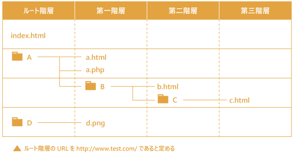

# HTML概要
HTML5＆CSS3標準デザイン講座/草野あけみ/翔泳社  
を参考に作成

- [0 HTMLってなんだろう？](#0)
- [1 基本タグ](#1)
- [2 ブロックレベルの基本タグ](#2)
- [3 インラインレベルの基本タグ](#3)
- [4 セクション関連要素](#4)
- [5 終わりに](#5)

## 0　HTMLってなんだろう？　<a id="0"></a>

HTMLはWebページを作成するための言語です。HTMLの主な役割は、文書の各部分がどのような役割も持っているのかを、役割ごとに目印をつけることです。目印がつけられた部分がどのような要素であるかを明確にすることで、コンピュータがその文書の構造を理解できるようになります。そして、この目印をつけることをマークアップと呼びます。では、どのようにマークアップしていけば良いのでしょうか。１つ例を見てみましょう。

`<p>初めてのHTML</p>`

"初めてのHTML"という文章が`<p>`と`</p>`で挟まれています。実はこれだけで"初めてのHTML"がどのような要素か明確に示されています。`<p>`と`</p>`のように要素に意味付けをしてくれる目印をタグと呼び、特に`<p>`を開始タグ、`</p>`を終了タグと呼びます。開始タグと終了タグの違いは`/`(スラッシュ)があるかないかだけです。また、開始タグと終了タグで囲まれた範囲のことを要素といいます。今回の例では"初めてのHTML"が要素ということになります。そして、要素がHTMLを構成する最も基本的な単位になります。では実際にどのようなタグが用意されているのかを見ていきましょう、と言いたいところですが、その前にHTML文書の基本的な構造だけ学んでおきましょう。


<details><summary>コピペ用雛形コード</summary><div>

```html
<!DOCTYPE html>
<html lang = "ja">
<head>
<meta charset = "utf-8">
<title>雛形コード</title>
<meta name = "keywords" content = "">
<meta name = "description" content = "">
</head>

<body>
---- ここに記事の中身を記述 ----
</body>
</html>
```

</div></details>


左に構造図を、右に雛形コードを載せました。まずは左と右がどのように対応しているか確認してみましょう。各要素の細かい説明が知りたい人は[要素 / dictionary-HTML.md](../dictionary-HTML.md#0-2)を見てみてください。ただし、実際にwebページの中身を記述するのは`<body>`タグで囲まれた部分ですので、それ以外はこう書いておけばいいんだととりあえずは理解しておけば問題ありません。

そしてもう一つだけ重要な概念を学ぶ必要があります。それがドキュメントツリーです。上の雛形コードを見てみると、`<html>`タグで囲まれた中に`<head>`タグと`<body>`タグが存在していることが分かります。このようにHTML文書は要素の入れ子によって構成されています。その状態をツリー上に表したものがドキュメントツリーで、ある要素の上位（外側）にある要素を親要素、下位（内側）にある要素を子要素と呼びます。HTML文書全体は、html要素を最上位（ルート）の親要素とする入れ子による親子関係で成り立っています。html要素から見てhead要素やbody要素は子要素、逆にhead要素やbody要素から見てhtml要素は親要素ということになります。ではhead要素から見てbody要素は何でしょう？このように親子関係のない要素同士（片方がもう一方に囲まれずお互いに独立しているということ）は兄弟要素と呼ばれます。そしてもうなんとなく察しが付くと思いますが、head要素から見てbody要素は弟要素、body要素から見てhead要素は兄要素ということになります。

参考：[要素の親子関係 / dictionary-CSS.md](../dictionary-CSS.md#1-0)  

## 1　基本タグ　<a id="1"></a>

ここでは基本タグを学びますが最初にネタバレをしてしまいましょう。

### 要素一覧  <a id="0-4"></a>

| 分類 | 要素 | 用途 |
|---|---|---|
| ブロック要素 | `<h1> ~ </h1>`（h6までの６段階） | 見出し |
| ブロック要素 | `<p> ~ </p>` | 段落 |
| ブロック要素 | `<ul> ~ </ul>` `<li> ~ </li>` | 箇条書きリスト |
| ブロック要素 | `<table> ~ </table>` | 表組 |
| ブロック要素 | `<address> ~ </address>` | 連絡先 |
| ブロック要素 | `<div> ~ </div>` | 任意の範囲・グループ化 |
| インライン要素 | `<a> ~ </a>` | ハイパーリンク |
| インライン要素 | `<em> ~ </em>` | 強調 |
| インライン要素 | `<strong> ~ </strong>` | 重要な語句 |
| インライン要素 | `` | 画像 |
| インライン要素 | `<span> ~ </span>` | 任意の範囲 |

### セクション関連要素  <a id="0-5"></a>

| 要素 | 用途 |
|---|---|
| `<header> ~ </header>` | ヘッダー領域（複数個存在してよい） |
| `<footer> ~ </footer>` | フッター領域 （複数個存在してよい）|
| `<main> ~ </main>` | メインコンテンツ領域 （１つのページで原則１つ）|
| `<section> ~ </section>` | 見出しを伴う一般的な論理構造を表すセクション |
| `<article> ~ </article>` | それだけで独立したセクション |
| `<aside> ~ </aside>` | 補足的なセクション |
| `<nav> ~ </nav>` | ナビゲーションのセクション |

これを一つずつ丁寧に取り上げて説明するのは大変ですし、なにより基本的にタグで囲まれた中身の意味が変わるだけで書き方はほとんど差がありません。ここではより実践的に、上の表を踏まえたうえで実際にどのようにマークアップしていけばよいかを下の文章を例にして話を進めましょう。因みに、先ほど例に挙げた`<p>`タグが何を意味するのか分かりましたか？分かったら次に行きましょう。

**例文**
```html
絵画に見られる遠近法

目次
遠近法
　空気遠近法
　透視図法


遠近法

空気遠近法

空気遠近法は、大気が持つ性質を利用した空間表現法です。例えば戸外の風景を眺めてみると、遠景に向かうほどに対象物は青味がかって見え、また同時に、遠景ほど輪郭線が不明瞭になり、対象物は霞んで見えます。

こういった性質を利用して空気遠近法では、遠景にあるものほど形態をぼやかして描いたり、色彩をより大気の色に近づけるなどして、空間の奥行きを表現します。

透視図法

遠近法の基本は視点の前に置いた「投影面」に、それを通過する光を写し取ることであり、それは窓ガラスを通して見える光景を窓ガラス表面に直接描画することに似ています。ガラスに写し取られた図は3次元の光景を縮小し2次元平面上に変換したものとなります。

図法として一点透視図法、二点透視図法、三点透視図法などがあります。これらは美術にとどまらず、建築、映画、アニメ、コンピュータグラフィックスなど、視覚表現の分野で広く使用されています。

参考文献
https://ja.wikipedia.org/wiki/%E9%81%A0%E8%BF%91%E6%B3%95
```

## 2　ブロックレベルの基本タグ  <a id="2"></a>

### `<h>` : 見出し
たいていの文章には見出しが用意されていることが多いでしょう。まずは見出しをマークアップしてみましょう。先ほどの表を見てみれば見出しは `<h1> ~ </h1>`（h6までの６段階）と書いてあります。見出しにも重要度がありますから重要度が高い順に`<h1>`から`<h6>`まで6種類用意されているというわけです。ただし、こういう場合にはこの番号の見出しタグを使わなければいけないというのは決められておらず、自分が相対的に決めてしまって良いものなのです。では先ほどの例文に戻ってどこが見出しになりそうか考えてみましょう。一番最初の行にある"絵画に見られる遠近法"という文言は恐らくこの文章の主題であるように思われます。ですからこれに`<h1>`を割り当ててみましょう。次に目次がありますね。目次も見出しと考えて良いでしょう。そして、どうもこの文章は空気遠近法と透視図法という2種類の遠近法について言及しているようです。これを踏まえると目次には`<h2>`、遠近法には`<h3>`、空気遠近法および透視図法には`<h4>`を割り当てるのが良さそうです。参考文献は今まで出てきたどの見出しとも並列にはなりえませんから`<h5>`としておきましょう。

```html
<h1>絵画に見られる遠近法</h1>

<h2>目次</h2>
遠近法
　空気遠近法
　透視図法


<h3>遠近法</h3>

<h4>空気遠近法</h4>

空気遠近法は、大気が持つ性質を利用した空間表現法です。例えば戸外の風景を眺めてみると、遠景に向かうほどに対象物は青味がかって見え、また同時に、遠景ほど輪郭線が不明瞭になり、対象物は霞んで見えます。

こういった性質を利用して空気遠近法では、遠景にあるものほど形態をぼやかして描いたり、色彩をより大気の色に近づけるなどして、空間の奥行きを表現します。

<h4>透視図法</h4>

遠近法の基本は視点の前に置いた「投影面」に、それを通過する光を写し取ることであり、それは窓ガラスを通して見える光景を窓ガラス表面に直接描画することに似ています。ガラスに写し取られた図は3次元の光景を縮小し2次元平面上に変換したものとなります。

図法として一点透視図法、二点透視図法、三点透視図法などがあります。これらは美術にとどまらず、建築、映画、アニメ、コンピュータグラフィックスなど、視覚表現の分野で広く使用されています。

<h5>参考文献</h5>
https://ja.wikipedia.org/wiki/%E9%81%A0%E8%BF%91%E6%B3%95
```

さあ、ここで、あれ？目次の下の遠近法、空気遠近法、透視図法をマークアップしないのかと思った方。何も気づかなかった方も、ここで自分でもhtmlファイルを作ってみることをお勧めしますよ。適当な場所に`index.html`をいうファイルを作って、そこに先ほど提示した雛形コードをコピペし`<body>`タグの中に上のマークアップ済み例文をコピペしてみましょう。どうなっているでしょうか？

<details><summary>index.htmlの中身</summary><div>

```html
<!DOCTYPE html>
<html lang = "ja">
<head>
<meta charset = "utf-8">
<title>雛形コード</title>
<meta name = "keywords" content = "">
<meta name = "description" content = "">
</head>

<body>
<h1>絵画に見られる遠近法</h1>

<h2>目次</h2>
遠近法
　空気遠近法
　透視図法


<h3>遠近法</h3>

<h4>空気遠近法</h4>

空気遠近法は、大気が持つ性質を利用した空間表現法です。例えば戸外の風景を眺めてみると、遠景に向かうほどに対象物は青味がかって見え、また同時に、遠景ほど輪郭線が不明瞭になり、対象物は霞んで見えます。

こういった性質を利用して空気遠近法では、遠景にあるものほど形態をぼやかして描いたり、色彩をより大気の色に近づけるなどして、空間の奥行きを表現します。

<h4>透視図法</h4>

遠近法の基本は視点の前に置いた「投影面」に、それを通過する光を写し取ることであり、それは窓ガラスを通して見える光景を窓ガラス表面に直接描画することに似ています。ガラスに写し取られた図は3次元の光景を縮小し2次元平面上に変換したものとなります。

図法として一点透視図法、二点透視図法、三点透視図法などがあります。これらは美術にとどまらず、建築、映画、アニメ、コンピュータグラフィックスなど、視覚表現の分野で広く使用されています。

<h5>参考文献</h5>
https://ja.wikipedia.org/wiki/%E9%81%A0%E8%BF%91%E6%B3%95
</body>
</html>
```

</div></details>

マークアップした部分は文字が大きくなってるはずです。実は目次の部分はもっと適したタグが存在します。それは後で説明しましょう。

### `<p>` : 段落
一番最初に紹介した`<p>`タグは段落を意味するタグでした。そういう意味では最初の例は不適切だったかもしれません。さて、例文を見てみると、空気遠近法、透視図法の説明両方とも意図的に2つの段落に分けられているようです。ですから各段落合計4つに対して`<p>`タグで囲んであげれば良さそうです。自分で囲んだ後何が起きるか見てみてください。先ほどは文字が大きくなりましたよね。

```html
<h1>絵画に見られる遠近法</h1>

<h2>目次</h2>
遠近法
　空気遠近法
　透視図法


<h3>遠近法</h3>

<h4>空気遠近法</h4>

<p>空気遠近法は、大気が持つ性質を利用した空間表現法です。例えば戸外の風景を眺めてみると、遠景に向かうほどに対象物は青味がかって見え、また同時に、遠景ほど輪郭線が不明瞭になり、対象物は霞んで見えます。</p>

<p>こういった性質を利用して空気遠近法では、遠景にあるものほど形態をぼやかして描いたり、色彩をより大気の色に近づけるなどして、空間の奥行きを表現します。</p>

<h4>透視図法</h4>

<p>遠近法の基本は視点の前に置いた「投影面」に、それを通過する光を写し取ることであり、それは窓ガラスを通して見える光景を窓ガラス表面に直接描画することに似ています。ガラスに写し取られた図は3次元の光景を縮小し2次元平面上に変換したものとなります。</p>

<p>図法として一点透視図法、二点透視図法、三点透視図法などがあります。これらは美術にとどまらず、建築、映画、アニメ、コンピュータグラフィックスなど、視覚表現の分野で広く使用されています。</p>

<h5>参考文献</h5>
https://ja.wikipedia.org/wiki/%E9%81%A0%E8%BF%91%E6%B3%95
```

### `<ul> ~ </ul>` `<li> ~ </li>` : 箇条書きリスト

先ほどの目次の項目はこの箇条書きリストで書くのが一般的です。このタグは`<ul>`と`<li>`がどちらも必ず必要です。`<ul>`は箇条書きエリアを示すためのタグであり、`<li>`は個別のリスト情報を示すためのタグです。例えば下のように書きます。
```html
<ul>
  <li>みかん</li>
  <li>りんご</li>
  <li>ぶどう</li>
</ul>
```
しかし、例文では遠近法と空気遠近法および透視図法は並列的な要素ではありません。そういう時は`li`要素の中にさらに新たな`ul`要素を入れることで、入れ子にしてさらに複雑な階層構造を持たせることができます。
```html
<ul>
  <li>空気遠近法
    <ul>
      <li>空気遠近法</li>
      <li>透視図法</li>
    </ul>
  </li>
</ul>
```
これについても自分で書いてみて結果を見てみましょう。

他にもブロック要素の基本タグはいくつかありますが、使う機会はほぼ無い（`div`要素だけは例外で後で説明します）といってよいです。したがって、ここまでの3要素をしっかり覚えておきましょう。

## 3　インラインレベルの基本タグ  <a id="3"></a>

次はインライン要素の基本タグについて学びます。前に説明した3要素はブロック要素でした。では何が違うんでしょう。実は現在、インライン要素・ブロック要素という区分けはされなくなりましたが、説明の便宜上昔の慣習を引用しています。簡潔に言うと、ブロック要素内にインライン要素を含めることはできるが、その逆はできません。ただし、これも一部例外があり、`<a>`タグに限ってはインライン要素ではあるがその中にブロック要素を内包することができます。これは後程説明することにしましょう。そして、インライン要素とブロック要素の決定的な違いとして、ブロック要素で囲った場合は自動的に改行されますがインライン要素は改行されません。

良い例：ブロック要素(`<p>`)の中にインライン要素(`<span>`)が入っている
```html
<p>
  <span>
    これはOK
  </span>
</p>
```
悪い例：インライン要素(`<span>`)の中にブロック要素(`<p>`)が入っている

```html
<span>
  <p>
    これはダメ
  </p>
</span>
```

### `<a>` : ハイパーリンク

webサイトには多くのハイパーリンクがあります。それを可能にするのが`<a>`タグです。例文の参考文献のところにはURLがそのまま書かれていました。これにリンクを設定し押すだけでWikipediaに飛べるようにしてみましょう。
```html
<a href = "https://ja.wikipedia.org/wiki/%E9%81%A0%E8%BF%91%E6%B3%95">遠近法 / Wikipedia</a>
```
今までとは少し様子が違いますね。今回はリンク先を表す文字列を"遠近法 / Wikipedia"としました。ここは何でも大丈夫です。問題は開始タグにURLが書かれていることですよね。実は要素タグにはオプション設定をつけることができ、これを属性と呼びます。各要素に共通な属性もあれば、特定の要素にしか存在しない属性もあります。今回のようにリンク先URL情報を文字に付加するには`href`属性を使います。後は見たまま、URLをダブルクオーテーション`""`で囲って`href`属性とイコールでつなげてあげれば完成です。実際に書いてみてリンク先に飛べるか試してみましょう。

### `<span>` : 任意の範囲

さあ困りました。用途が任意の範囲とはどういうことでしょう。今まで紹介してきたタグは、すべて囲むことでその中の要素に意味付けがされるものでした。ところが`<span>`タグで囲っても何も意味付けはなされないどころか表示も一切変わりません。なぜこのようなタグが用意されているのかはCSSを学んでからにしましょう。

### `<br>` : 改行

実はHTML文書内で改行してもweb上で見てみると改行がされていないことが分かります。改行するには`<br>`タグを用いましょう。ただし、今まで出てきたタグと決定的に違うのは終了タグが無いということです。これは要素を囲む用途で使用するわけではないので当然と言えば当然ですね。
```html
改行される前です。<br>改行された後です。
```

### `` : 画像

さあこれでインライン要素も最後です。webページに画像を入れてみましょう。ここで一つ重要なことを学ばなければいけません。画像の場所を示すには「パス」というものが必要です。パスはファイルの場所を示すための大切な仕組みです。



PCにはいろんなデータが階層構造をもって保管されています。上の図を見てみてください。例えばルート階層をデスクトップだと考えると、この場合デスクトップにはファイルindex.html、フォルダA、フォルダDがあることが分かります。また、フォルダAの中にはファイルa.htmlとファイルa.php、フォルダBがあります。このよう階層構造においてファイルの位置を正確に表す手法がパスです。パスの表し方にも大きく分けて絶対パスと相対パスの2種類が存在します。実際にはこの図はweb上でのファイルの位置を表していますが、PC上でもweb上でも仕組みに何ら違いはありません。唯一、ルート階層がURL（ここではhttp://www.test.com/ ）で表されているということでしょうか。では以下にパスの書き方の例をいくつか載せますので例を見ることで理解してみましょう。

### 絶対パス  
index.html ・・・ http://www.test.com/index.html  
a.php ・・・ http://www.test.com/A/a.php  
b.html ・・・ http://www.test.com/A/B/b.html  
c.html ・・・ http://www.test.com/A/B/C/c.html  
d.png ・・・ http://www.test.com/D/d.png  

### 相対パス（全てa.htmlから見た相対パス）  
index.html ・・・ ../index.html  
a.php ・・・ ./a.phpまたはa.php  
b.html ・・・ B/b.html  
c.html ・・・ B/C/c.html  
d.png ・・・ ../D/d.png  

### 相対パス（全てb.htmlから見た相対パス）  
index.html ・・・ ../../index.html  
a.php ・・・ ../a.php  
c.html ・・・ C/c.html  
d.png ・・・ ../../D/d.png  

基本的に下の階層に行くにはフォルダ名を/で区切ればよいです。絶対パスは、ルート階層（最上位階層）のURLであるhttp://www.test.com/ に加えて/フォルダ名を付け足して行くだけです。それに対し、相対パスはある階層を基準として上下に行き来する指定方法です。上記の例ではa.htmlとb.htmlを基準に相対パスを表記しました。基準によって、当然表記の仕方も変わます。上の階層に行くには../を書きましょう。ちなみに、同一階層は./で表すことになっています、これは省略可能です。

※ ルート相対パスという表記法も存在します。これは、常に最上位のルート階層を基準とするものであり、絶対パスのhttp://www.test.com/ を/に置き換えたものです。

では以上を踏まえたうえでwebページに画像を挿入してみましょう
```html

```
なんかまたいろんな属性がついてますね。まずは``は`<br>`同様要素を囲んで使用するわけではないので終了タグはありません。そして、ハイパーリンクの時は`href`属性を用いましたが、画像の位置を示すには`src`属性を使います。ではこの一文が書かれてるindex.htmlから見てmillet.jpgはどのような位置にあると言えるでしょうか？まず相対パスで書かれているだろうと分かります。そして最初のスラッシュ手前のimgは拡張子がありませんからimgフォルダであることが分かります。よってindex.htmlがある階層と同じ階層にimgフォルダがあり、その中にmillet.jpgという画像が保管されているようですね。次に`width`、`height`属性ですがこれは名前の通り画像の横幅と高さを設定する属性です。画像を常に同じ大きさで表示させたいときなどはこの属性を設定します。そして、最後のalt属性は、画像が何らかの影響で表示されなかった場合、代わりに表示するテキストです。altテキストを見ればそこに何の画像があるのか分かるようなテキストを入れる必要があり、原則設定するようにしましょう。では実際に今まで使用してきた例文に画像を含めてみましょう。画像はこの基礎問題集と同じ階層にあるpractice_imgフォルダ内に入っていますのでダウンロードして使って見てください。もちろん画像の位置をちゃんと決めて、その場所に従うように`src`属性を書かないと表示されませんよ。

```html
<h1>絵画に見られる遠近法</h1>

<h2>目次</h2>
<ul>
  <li>空気遠近法
    <ul>
      <li>空気遠近法</li>
      <li>透視図法</li>
    </ul>
  </li>
</ul>


<h3>遠近法</h3>

<h4>空気遠近法</h4>

<p>空気遠近法は、大気が持つ性質を利用した空間表現法です。例えば戸外の風景を眺めてみると、遠景に向かうほどに対象物は青味がかって見え、また同時に、遠景ほど輪郭線が不明瞭になり、対象物は霞んで見えます。</p>

<p>こういった性質を利用して空気遠近法では、遠景にあるものほど形態をぼやかして描いたり、色彩をより大気の色に近づけるなどして、空間の奥行きを表現します。</p>


<p>ミレー作「落ち穂拾い」には空気遠近法が効果的に用いられていることが見て取れます。遠くにあるほど薄い色、逆に近くにあるほど濃い色を使用することで遠近感を明瞭に描いています。</p>

<h4>透視図法</h4>

<p>遠近法の基本は視点の前に置いた「投影面」に、それを通過する光を写し取ることであり、それは窓ガラスを通して見える光景を窓ガラス表面に直接描画することに似ています。ガラスに写し取られた図は3次元の光景を縮小し2次元平面上に変換したものとなります。</p>

<p>図法として一点透視図法、二点透視図法、三点透視図法などがあります。これらは美術にとどまらず、建築、映画、アニメ、コンピュータグラフィックスなど、視覚表現の分野で広く使用されています。</p>

<h5>参考文献</h5>
https://ja.wikipedia.org/wiki/%E9%81%A0%E8%BF%91%E6%B3%95
```

勢いあまって画像の後に段落を付け足してしまいましたが、無事に画像は表示されたでしょうか。表示されない場合は大抵パスの指定が間違ってることが多いのでよく確認しましょう。


## 4　セクション関連要素  <a id="4"></a>

一番最初にネタバレした表は2つありました。1つは今まで習ったインライン要素およびブロック要素ですが、もう一つセクション関連要素というものがあります。実はこのセクション関連要素のどれを使って要素を囲んでも何も見た目に影響はしないので、必ず使う必要があるというわけではないのですが、出来る限り使うようにしましょう。文書構造の明確化およびSEO対策に効果的という理由ですが深くは立ち入らないようにしておきましょう。

まずは、理工展連絡会のサイトを例に、webページのどの部分がどの要素に当たるのかを見てみましょう。


セクション関連要素は囲む要素が明確に決まっているわけではないですし、webサイトの作りというのは大方同じですのである程度見た目でそれぞれの役割を覚えてしまいましょう。ちなみに、上の図の`nav`部分は`header`に含めてしまっても問題ありません。ではこれを踏まえたうえで、今までマークアップしてきた例文に戻って、セクション関連要素で囲んでみましょう。

```html
<header>
  <h1>絵画に見られる遠近法</h1>
</header>

<nav>
  <h2>目次</h2>
  <ul>
    <li>空気遠近法
      <ul>
        <li>空気遠近法</li>
        <li>透視図法</li>
      </ul>
    </li>
  </ul>
</nav>

<main>
  <article>
    <h3>遠近法</h3>

    <section>
      <h4>空気遠近法</h4>

      <p>空気遠近法は、大気が持つ性質を利用した空間表現法です。例えば戸外の風景を眺めてみると、遠景に向かうほどに対象物は青味がかって見え、また同時に、遠景ほど輪郭線が不明瞭になり、対象物は霞んで見えます。</p>

      <p>こういった性質を利用して空気遠近法では、遠景にあるものほど形態をぼやかして描いたり、色彩をより大気の色に近づけるなどして、空間の奥行きを表現します。</p>

      

      <p>ミレー作「落ち穂拾い」には空気遠近法が効果的に用いられていることが見て取れます。遠くにあるほど薄い色、逆に近くにあるほど濃い色を使用することで遠近感を明瞭に描いています。</p>
    </section>

    <section>
      <h4>透視図法</h4>

      <p>遠近法の基本は視点の前に置いた「投影面」に、それを通過する光を写し取ることであり、それは窓ガラスを通して見える光景を窓ガラス表面に直接描画することに似ています。ガラスに写し取られた図は3次元の光景を縮小し2次元平面上に変換したものとなります。</p>

      <p>図法として一点透視図法、二点透視図法、三点透視図法などがあります。これらは美術にとどまらず、建築、映画、アニメ、コンピュータグラフィックスなど、視覚表現の分野で広く使用されています。</p>
    </section>

    <section>
      <h5>参考文献</h5>
      https://ja.wikipedia.org/wiki/%E9%81%A0%E8%BF%91%E6%B3%95
    </section>
  </article>
</main>
```

`<article>`および`<section>`には原則見出しタグが必要ですので忘れないようにしましょう。今回は説明の都合上一番最後にセクション関連要素をマークアップしましたが、実際にwebページを作る時はセクション関連要素を一番最初にマークアップして大まかな構造を決定するので注意しましょう。

## 5　終わりに  <a id="5"></a>

以上でHTML関連で学ぶことは大体終了しました。唯一、ブロック要素の`<div>`およびインライン要素の`<span>`はCSSと同時に学ぶのがいいのでCSS編で説明しています（[`div`要素と`span`要素 / Overview_CSS.md](Overview_CSS.md#1-5)）。ここまでいかがだったでしょうか。ここで皆さんに注意してもらいたいことがあります。それは、今まで学んだことを暗記してはいけないということです。もちろん暗記するのがダメというわけではなくて、暗記しようと思って取り組むのがダメなのです。なぜなら、コーディングやプログラミングはテストではありません。ですので分からなければいつでも見返して思い出すことができます。これからCSSを学ぶことになりますが多くの学ぶことが出てきます。それをすべて暗記しておくというのは労力の無駄でしかありません。分からなければ調べて思い出すというのを大前提として、暗記ではなく実際にコードを書いて自然に覚えていくというのを目指して進めていきましょう。
