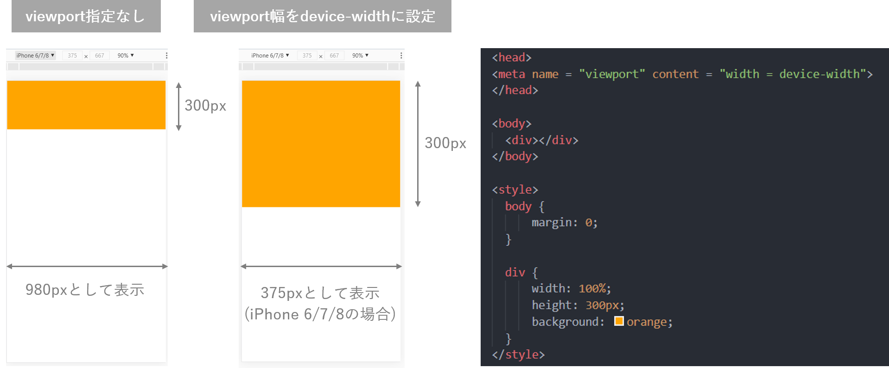
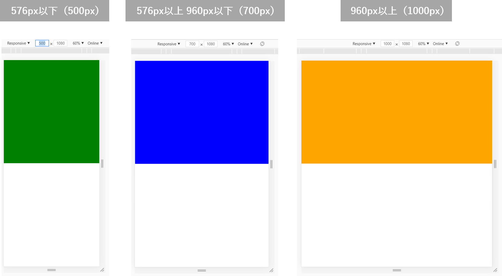

# マルチデバイス対応およびグリッドレイアウト
HTML5＆CSS3標準デザイン講座/草野あけみ/翔泳社  
を参考に作成

- [1 マルチデバイス対応の基礎知識](#1)
  - [1-1 `viewport`](#1-1)
  - [1-2 ベクター画像](#1-2)
  - [1-3 モバイル対応の手法](#1-3)
  - [1-4 デベロッパーツールのデバイスモード機能](#1-4)
- [2 メディアクエリ](#2)
- [3 ブレイクポイントの決定](#3)
- [4 レスポンシブサイトの制作](#4)
  - [4-1 PC版の制作](#4-1)
  - [4-2 スマホ版の制作](#4-2)

**Column**
- [C-1　ブロックレベルの要素の左右中央配置](#c-1)

## 1　マルチデバイス対応の基礎知識　<a id="1"></a>

令和元年に行われた通信利用動向調査では、パソコンを使用してインターネットを利用した人が71.9%であるのに対し、スマートフォンを使用した人が79.5%と、個人のインターネット接続の主流はパソコンからスマートフォンへと移りつつあります。このような中、webサイトがモバイル対応を行うのは必須であると言えるでしょう。ここでは、いかにしてwebサイトをマルチデバイスに対応させればよいかを説明していきます。

### 1-1　`viewport`　<a id="1-1"></a>

`viewport`とは、モバイル端末においてデバイスのスクリーンを何ピクセル × 何ピクセルとして扱うかを設定するものです。スマートフォンで閲覧すると、たまにPC版をそのまま縮小表示したwebサイトに出会うことがあります。これはデフォルトの`viewport`が多くの場合横幅`980px`に設定されているためです。この状態でPCサイトを閲覧した場合、本来`400px`程度しかないディスプレイに`980px`分の情報を縮小して詰め込む形になるため、文字が小さくなり拡大しないと読めないなど閲覧が非常に大変になります。

そこで、モバイル向けのwebサイトを制作する際には、モバイルの画面サイズに最適化されたレイアウトにした上で、それをデバイス本来の画面サイズに合わせた`viewport`で表示する必要があります。

`viewport`の値を変更するには、`meta`要素を使います。HTMLの`head`要素の中で以下のように記述すると、それぞれのデバイス本来のスクリーンサイズに合わせて自動的に`viewport`のサイズを調整してくれるようになります。webサイトを作る場合は必ずこれを書いておきましょう。

```html
<meta name = "viewport" content = "width = device-width">
```



### 1-2　ベクター画像　<a id="1-2"></a>

webで扱う画像形式は、主にJPEG / PNG / GIFの3種類です。これらの違いを軽く紹介しておきます。

| 形式 | GIF | JPEG | PNG-8 | PNG-24/32 |
|---|---|---|---|---|
| 色数 | 最大256色 | フルカラー | 最大256色 | フルカラー |
| 圧縮方法 | 可逆圧縮 | 非可逆圧縮 | 可逆圧縮 | 可逆圧縮 |
| 圧縮率 | 中 | 高 | 高 | 低 |
| 透過機能 | 〇 | × | 〇 | 〇 |
| アルファチャンネル | × | × | △ | 〇 |
| アニメーション | 〇 | × | × | × |
| 用途 | アイコン・イラスト | 写真 | アイコン・イラスト | 半透明処理画像 |

これらはすべてビットマップ画像と呼ばれるもので、細かいドット（画素）の集合体であり、その一つ一つに色を塗ることで画像を表現しています。こういった画像は拡大することで画質の劣化が目立つようになります。このような画質劣化の対策としてベクター形式の画像があります。ベクター形式の画像はその形状を数式で表現するため、どれだけ拡大してもエッジが荒くなることが無く、常にシャープな状態で表示させることができます。これをSVG画像と言い、写真などには使えませんが、多色イラストはこの形式を用いることで画質劣化を防ぐことができます。


### 1-3　モバイル対応の手法　<a id="1-3"></a>

モバイル対応には、PCサイトとは別に「モバイル専用サイト」を構築する方法と、PCサイトと同じHTMLを使用して「レスポンシブwebデザイン」で構築する2通りがあります。

モバイル専用サイトを作る場合、モバイルユーザーならではのニーズや行動特性に合わせた最適なコンテンツ構成を提供でき、設計・デザインの自由度が高くなります。ただし、制作、運用、メンテナンスが二度手間になることから制作コストが高くなります。

反対に、レスポンシブwebデザインでは同一HTMLを使用し、CSSを用いて画面サイズに応じたレイアウトやUI設計のみを行うため楽にマルチデバイス対応をすることができます。しかしながら、同じHTMLを使用するためにデザインやレイアウトに技術的な制約が発生します。また、レスポンシブでありながらPCとモバイルでコンテンツそのものを大きく変えるような構成にしてしまうと、二重メンテナンスによるミスやデータサイズの増大といった問題を引き起こします（理工展連絡会のHPはこういった状況になっていますが）。

ここではレスポンシブwebデザインについて詳しく説明していきます。

### 1-4　デベロッパーツールのデバイスモード機能　<a id="1-4"></a>

PCでwebサイトを制作する際、デベロッパーツールのデバイスモード機能を使用することで、スマートフォン等でどのようにwebサイトが表示されているかを知ることができます。


## 2　メディアクエリ　<a id="2"></a>

レスポンシブwebデザインに入る前に、マルチデバイス対応サイトの制作に欠かせないメディアクエリの機能について、その仕組みと使い方を説明します。

メディアクエリは、ウィンドウのサイズやモニタの物理サイズ、画面密度やデバイスの向きなど、閲覧環境の特性に応じてCSSを分岐させることができる機能です。CSSファイル内に以下のように記述することでCSSの条件分岐をすることができるようになります。

```css
@media screen and (メディア特性) {
  スタイル設定
}
```
メディア特性にはいろいろありますが、基本`min-width`もしくは`max-width`しか使いませんので、これだけ知っておけば特に問題はないでしょう。

| 特性 | 条件 | 最大値 / 最小値 | 値 |
|---|---|---|---|
| width | 表示領域（ブラウザ画面）の幅 | max- / min- | 数値 |

以下の例ではメディアクエリを使用して、横幅に応じて背景色が変化するようにしました。



```html
<head>
  <meta name = "viewport" content = "width = device-width">
</head>

<body>
  <div></div>
</body>
```

```css
body {
  margin: 0;
}

div {
  width: 100%;
  height: 50%;
  background: orange;
}

/* 576px以下 */
@media screen and (max-width: 576px) {
  div {
    background: green;
  }
}

/* 576px以上 960px以下 */
@media screen and (min-width: 576px) and (max-width: 960px) {
  div {
    background: blue;
  }
}
```

ここで表示を切り替える画面幅を**ブレイクポイント**と呼び、上の例では`576px`と`960px`がそれにあたります。

CSSは上に記述したものから読み込まれていき、下に記述されたもので上書きされるようにできています。メディアクエリも同様で、メディアクエリに指定された横幅の場合にのみその中に記述されているCSSを読み込むことで、それより上に書かれたCSSを上書きし、結果的にデバイスごとに表示を切り替えることができるようになっています。逆に言えばメディアクエリの下でCSSを上書きした場合には、当然メディアクエリ内の記述は無視されることになってしまいます。ですから、通常メディアクエリはCSSの一番最後に書き足すことになります。上の例では、960px以下の場合は背景色を上書きしましたが、960px以上のメディアクエリは使用していないためその場合には最初に記述した`background: orange;`が適用されることになります。

上の例のように、横幅が大きい画面（PC等）の時のCSSを最初に記述しておいて、画面が小さい場合の表示をメディアクエリで指定する方法をPCファーストと呼びます。これとは逆に、横幅が小さい画面の時のCSSを最初に記述しておく方法をスマホファーストと呼びます。どちらもさほど変わりありませんが、PCからの流入が多いならPCファースト、スマホからの流入が多いならスマホファーストにするのが無難でしょう。

## 3　ブレイクポイントの決定　<a id="3"></a>

レスポンシブwebデザインでは、ある一定の画面サイズを基準としてCSSでレイアウトを切り替えるように作ります。このブレイクポイントを設定するサイズをいくつにするのか、いくつブレイクポイントを用意するのかなどは特に決まっていないため、基本的にはウィンドウサイズに対するコンテンツの見せ方によってブレイクポイントを設定することが多くなっています。スマートフォン向けとPC向けのレイアウトパターンを用意して、その境目にブレイクポイントを一つ用意し、必要に応じてコンポーネント単位でブレイクポイントを設けてレイアウトを調整する方法が一番楽です。中間のタブレット用レイアウトパターンを作る場合もありますが、これは必要に応じて作る程度で良いかと思います（デザインカンプを3種類作るのが大変だからです）。

### 最小ブレイクポイント

スマートフォン向けレイアウトとそれ以外を切り分ける為の重要なブレイクポイントです。基本的にこのブレイクポイントを境に小さい画面ではシングルカラム、大きい画面ではマルチカラムがレイアウトのベースとなります。カラムとは段組みという意味で、PC版のレイアウトでは右や左にサイドバーがある2カラムレイアウトやそれ以上のマルチカラムレイアウトを見かけるかと思います。`576px`や`640px`、`768px`といった数値がよく見られます。


### 最大ブレイクポイント

最大ブレイクポイントはそれ以上は横幅固定レイアウトに変更するためのブレイクポイントとなり、基本的にPCレイアウトにおけるコンテンツ固定幅と同じになります。`960px`や`992px`、`1024px`といった`1000px`前後の数値が良く用いられます。きっと何を言っているのか分からないと思いますので、簡単な例を示して説明することとしましょう。


例えばPC版表示（横幅`1920px`）でこのようなサイトがあったとします。この場合、記事部分の横幅（白い部分）は`980px`で固定表示されています。これが横幅固定レイアウトです。仮に横幅固定にしないとどうなるでしょうか。


とんでもなく読みづらいことが分かると思います。このように文章幅は`700 ~ 1000px`程度にしておくことで読みやすさを担保できます。ですから、`1920px`等といった横幅の広いレイアウトの場合は横幅固定をするのが一般的です。

では逆にスマホ版で固定幅にするとどうなるでしょうか。


大きい画面幅に合わせると横が見切れてしまうし、小さい画面幅に合わせると左右の余白が無駄に大きくなってしまいます。したがって、スマホ版では`width: 100%;`などを指定することで画面サイズに合わせて横幅を可変にするのが一般的です。

### 中間ブレイクポイント

`600 ~ 900px`前後の中間サイズ付近は、スマートフォン向けレイアウトでは間延びしたり、PC向けレイアウトでは窮屈すぎるという不具合が出やすいサイズであり、必要に応じてブレイクポイントを追加することで表示を調整します。

## 4　レスポンシブサイトの制作　<a id="4"></a>

この章では、メディアクエリを用いて実際に簡単なレスポンシブサイトを作ってみることとします。下に載せた仕様書をクリックすることでダウンロードボタンがあるページに飛ぶことができますので、そこからダウンロードして詳しく見ることをお勧めします（このファイルと同じ階層に`practice_img`フォルダがあり、そこに`練習用レイアウト_仕様書.png`という名前でありますのでそこからダウンロードしていただいても構いません）。


**コピペ用文章**

```
空気遠近法は、大気が持つ性質を利用した空間表現法です。例えば戸外の風景を眺めてみると、遠景に向かうほどに対象物は青味がかって見え、また同時に、遠景ほど輪郭線が不明瞭になり、対象物は霞んで見えます。

こういった性質を利用して空気遠近法では、遠景にあるものほど形態をぼやかして描いたり、色彩をより大気の色に近づけるなどして、空間の奥行きを表現します。
```

左にPC版のレイアウト、右にスマホ版のレイアウトが掲載されています。PC版の2カラムを表示するには横幅が最低`760px + 80px + 300px = 1140px`必要ですから、少なくともこれ以上で最大ブレイクポイントを設定する必要がありそうです。今回は最大ブレイクポイントを`1200px`にしてみることにしましょう。次に、最小ブレイクポイントを決める必要がありますが、これは記事幅である`760px`に設定するのが好ましいように思われます。つまり、`760px`までは画面の横幅に応じて記事の横幅も大きくなっていくが、`760px`を境に記事の横幅が固定されるということです。当然これより多少大きくても問題はないので、あくまでも一例というだけです。`760px ~ 1200px`の間はシングルカラムであることは変わらないので、画面サイズに応じて左右の余白の幅を大きくしていくこととしましょう。

### 4-1　PC版の制作　<a id="4-1"></a>

では次に、実際にどのようにHTMLを記述すればよいかを考えていきましょう。今回はPCファーストでソースコードを書いていこうと思います。青色の部分は`header`、下の濃い灰色の部分は`footer`を使用すれば良さそうです。では真ん中の記事部分はどうすればよいでしょうか。[Q4. 【応用】要素のくくり方 / Workbook_Basic.md](Workbook_Basic.md#Q4)で学んだことを思い出して少し考えてみてください。

---

### C-1　ブロックレベルの要素の左右中央配置　<a id="c-1"></a>

あっと、1つ皆さんに教え忘れていたことがありました。上のレイアウトでは記事と目次が画面の真ん中に表示されています。どんな横幅であれ真ん中表示させる必要があるのですが、これはすぐに実現することができます。


```html
<div></div>
```

```css
div {
  background: orange;
  width: 800px;
  height: 500px;
  margin: 0 auto;
}
```

たったこれだけです。要素の`width`を指定することでコンテンツ領域の横幅が決定されるため、左右の`margin`を`auto`にしておくことで左右に均等に余白が割り当てられます。

---

さて、いかがでしょうか。[Q4. 【応用】要素のくくり方 / Workbook_Basic.md](Workbook_Basic.md#Q4)で説明したように、要素の大きいくくりを意識することで適切にHTMLを記述できるようになります。まずは、記事と目次を真ん中表示させる必要がありますから、これら二つを包含する要素を作る必要がありそうです。次に、記事と目次を横並びにさせる必要があります。これは`flex`を使うんでしたよね。ひとまずここまでを書いてみましょう。`viewport`を忘れずに書いておいてください。これを書かないと、メディアクエリを書いてもスマホ版のデザインがが反映されなくなります。

```html
<html>

<head>
  <meta name = "viewport" content = "width = device-width">
</head>

<body>
  <header></header>

  <main>
    <article></article>
    <nav></nav>
  </main>

  <footer></footer>
</body>

</html>
```

存在感が薄くて忘れていたかもしれませんが、セクション関連要素というものがありますので忘れず使うようにしましょう。一番大きいくくりに`main`を、記事部分を`article`、目次（ナビゲーション）部分を`nav`を用いてマークアップを行いました。

**セクション関連要素**

| 要素 | 用途 |
|---|---|
| `<header> ~ </header>` | ヘッダー領域（複数個存在してよい） |
| `<footer> ~ </footer>` | フッター領域 （複数個存在してよい）|
| `<main> ~ </main>` | メインコンテンツ領域 （１つのページで原則１つ）|
| `<section> ~ </section>` | 見出しを伴う一般的な論理構造を表すセクション |
| `<article> ~ </article>` | それだけで独立したセクション |
| `<aside> ~ </aside>` | 補足的なセクション |
| `<nav> ~ </nav>` | ナビゲーションのセクション |

次に見出しをマークアップしていきます。ヘッダー部分に`h1`、記事の大見出しに`h2`、小見出しに`h3`を割り当てれば良さそうです。目次は`h4`としておきましょう。その他、目次の内容は`ul`、`li`を使うのが一般的でしたよね。記事の文章も段落に分かれているようですので`p`要素も使う必要がありそうです。さてこれらをマークアップしていきます。

```html
<html>

<head>
  <meta name = "viewport" content = "width = device-width">
</head>

<body>
  <header>
    <h1>一点透視図法とその応用</h1>
  </header>

  <main>
    <article>
      <h2>遠近法</h2>
      <h3>空気遠近法</h3>
      <p>空気遠近法は、大気が持つ性質を利用した空間表現法です。例えば戸外の風景を眺めてみると、遠景に向かうほどに対象物は青味がかって見え、また同時に、遠景ほど輪郭線が不明瞭になり、対象物は霞んで見えます。</p>
      <p>こういった性質を利用して空気遠近法では、遠景にあるものほど形態をぼやかして描いたり、色彩をより大気の色に近づけるなどして、空間の奥行きを表現します。</p>
    </article>
    <nav>
      <h4>目次</h4>
      <ul>
        <li>遠近法
          <ul>
            <li>空気遠近法</li>
            <li>透視図法</li>
          </ul>
        </li>
        <li>一点透視図法
          <ul>
            <li>一点透視図法の性質</li>
            <li>描き方</li>
            <li>消失点の特定</li>
          </ul>
        </li>
      </ul>
    </nav>
  </main>

  <footer></footer>
</body>

</html>
```

これでHTMLは完成です。次にCSSを書いていきましょう。まずは、`main`の横幅を`1140px`に固定し、左右の`margin`を`auto`にすることで記事と目次を左右中央に配置しましょう。その他`header`および`footer`の大きさを指定して色を反映させ、`article`や`nav`の横幅を指定しました。また、`article`と`nav`を横並びにする必要がありますから、両方の親要素である`main`に`display: flex;`を適用させます。

```css
body {
  margin: 0;
}

main {
  width: 1140px;
  margin: 0 auto;
  display: flex;
  color: #575F65;
}

header {
  height: 500px;
  width: 100%;
  background: #7BB0DC;
}

article {
  width: 760px;
  margin-right: 80px;
}

nav {
  width: 300px;
}

footer {
  height: 100px;
  width: 100%;
  background: #767676;
}
```

ここまでで以下のような表示になってるはずです。このようにして、最初は細かいCSSを無視して大きなレイアウトをくみ上げる事で、見通しが良くなります。


次に、細かいCSSを適用させましょう。ここから先は[Workbook_Basic.md](Workbook_Basic.md)で紹介した部分ですので説明は省略します。以下に上のCSSと同じセレクタが書かれている部分は、その中にあるプロパティを追記したという意味です。

```css
main {
  padding: 100px 0;
}

nav {
  background: #EFEFEF;
}

h1 {
  font-size: 40px;
  color: white;
  font-weight: normal;
}

h2 {
  height: 60px;
  line-height: 60px;
  font-size: 24px;
  padding: 0 20px;
  border-left: 1px solid #575F65;
  font-weight: normal;
}

h3 {
  height: 50px;
  line-height: 50px;
  font-size: 20px;
  padding: 0 20px;
  background: #EFEFEF;
  border-radius: 10px;
  margin-top: 40px;
  font-weight: normal;
}

h4 {
  height: 45px;
  text-align: center;
  font-weight: bold;
  background: #D8D8D8;
  line-height: 45px;
  padding: 0 30px;
  margin: 0;
}

ul {
  list-style-type: none;
  font-weight: bold;
  padding: 0;
  margin: 0;
}

nav > ul > li > ul {
  font-weight: normal;
  padding-left: 20px;
}

nav > ul {
  margin: 30px;
}

p {
  margin: 30px 0 0;
}
```

おそらく今まで習ったことを総動員することで以下の表示までたどり着くことができるはずです。


ここまで来て二つほど問題が生じています。1つは`h1`をどのようにセンタリングするか。もう一つはなぜか目次の縦幅が長くなってしまっていることです。

`h1`のセンタリングは`text-align: center;`および`line-height: 500px;`をもちいれば行うことは可能です。ただし、行間を`500px`にするのは少し気持ち悪いと言わざるを得ないと思います。そこで、ここでは`flex`を用いたセンタリング方法を紹介します。

まずはセンタリングする要素をフレックスアイテムにするため、その親要素に`display: flex;`を適用します。フレックスアイテムとすることで、`flex`に用意されているセンタリング用のプロパティ`justify-content: center;`および`align-items: center;`を使うことができるようになり、簡単に中央に表示させることができます。このプロパティは、[justify-content（横方向の整列）/ Overview_CSS.md](Overview_CSS.md#justify-content)で紹介していますので忘れている場合は思い出してください。

```css
header {
  display: flex;
  justify-content: center;
  align-items: center;
}
```

さて、もう一つ目次の縦幅が長くなる問題を解決しなければいけません。これはフレックスアイテムの`align-items`プロパティの初期値が`normal`に設定されていることが原因です。ほとんどの場合、`align-items: normal;`は`align-items: stretch;`と同じ動作をし、この場合、フレックスアイテムの高さは自動的に全て同じになるように調整されます。フレックスアイテムの`height`を指定した場合にはその通りの高さになりますが、今回の場合は、目次の内容に応じて高さを可変にしたいはずです。ですので`align-items: flex-start;`と追記することでフレックスアイテムの高さが自動的に揃えられるのを防ぎましょう。`flex-start`にした理由は、記事と目次を上端揃えしたいからです。他にも揃えたい位置に応じて様々な値が用意されています。

```css
main {
  align-items: flex-start;
}
```

### 4-2　スマホ版の制作　<a id="4-2"></a>

ここまで来てようやくメディアクエリを用いた条件分岐を行います。まずは、最大ブレイクポイントから設定していきましょう。

```css
@media screen and (max-width: 1200px) {

}
```

CSSの最後に上のように書けば良かったんですよね。ここでも大きなレイアウト決めを行ってから細かいCSSを調整していきます。最も大きい変化は、シングルカラムになることですがここで問題があります。PC版では横並びになっている要素を、`1200px`以下では縦に並べる必要があること、そしてHTMLには記事、目次の順番で書いてありますが縦に並べる場合はこの順番を逆にしなければならないこと。ですが安心してください。`flex`には便利なプロパティが大量にあるのでこのような問題は想定内です。

`flex-direction`は要素の配置方向を指定するプロパティです。初期値は`row`ですので自動的に左から右に横並びされます。今回は縦方向に並べる必要があり、かつ並び順を逆にしたいので`flex-direction: column-reverse;`を適用しましょう。その他、シングルカラムになったことで`main`の`width`は`article`の横幅と同じく`760px`になりました。中央揃えさせたいのでこれも指定しておきましょう。

**flex-direction**

| 値 | 用途 |
|---|---|
| `row`（初期値） | 主軸は水平。要素の配置方向が左から右に配置される |
| `row-reverse` | 主軸は水平。`row`の逆で、要素の配置方向が右から左に配置される |
| `column` | 主軸は水直。要素の配置方向が上から下に配置される |
| `column-reverse` | 主軸は水直。`column`の逆で、要素の配置方向が下から上に配置される |

  

```css
@media screen and (max-width: 1200px) {
  main {
    width: 760px;
    flex-direction: column-reverse;
  }
}
```

  ひとまずこれで縦並びにはなりました。`760px ~ 1200px`のデザインカンプは作られていないので本来は自由に調整してもらって構いませんが、ここでは分量が多くなってしまうのでスマホ版の調整に移ります。また同様にCSSの一番最後に以下の記述を付け足しましょう。

```css
@media screen and (max-width: 760px) {

}
```

ここで一番の変化は`article`と`nav`の`width`が`100%`になることですよね。そこに注意して以下のようにCSSを上書きしてあげればスマホ版も完成です。

```css
@media screen and (max-width: 760px) {
  main {
    width: 100%;
    padding: 0;
  }

  article {
    width: calc(100% - 20px);
    margin: 40px auto;
  }

  nav {
    width: 100%;
    margin: 0;
  }

  header {
    height: 300px;
  }

  h1 {
    font-size: 30px;
  }
}
```

いやいや`calc`ってなんだし…。

`width`を`100%`にするのは良いんですが、`article`の左右の余白を設けようと`margin`を付け足したりすると`article`が見切れてしまうと思います。`width: 100%`によりコンテンツ領域の横幅が画面サイズと一致するため、`padding`や`margin`を付け足すとその分横幅が大きくなってしまうということですね。ここでCSSの関数として`calc`関数があることを知っていると非常に便利です。CSSは通常計算が出来ないのですが、この`calc`関数を使用することで計算ができるようになります。しかも上の例のように`%`と`px`を混在させた計算などもできます。今回は`article`の横幅を画面サイズよりも`20px`小さくすることにより、後は先ほど説明した左右`margin`を`auto`にすることで中央揃えしています。

`calc`関数を使用しなくても、`h2`、`h3`、`p`すべてに`padding: 0 10px;`を指定することで同様の表示にはなりますが、これをやるのは面倒ですし、これ以外の要素を入れるときには記述を付け足す必要が出てきます。とても便利なので是非覚えておいてください。

<details><summary>完成したコード</summary><div>

```html
<html>
<head>
  <meta name = "viewport" content = "width = device-width">
</head>


<body>
  <header>
    <h1>一点透視図法とその応用</h1>
  </header>

  <main>
    <article>
      <h2>遠近法</h2>
      <h3>空気遠近法</h3>
      <p>空気遠近法は、大気が持つ性質を利用した空間表現法です。例えば戸外の風景を眺めてみると、遠景に向かうほどに対象物は青味がかって見え、また同時に、遠景ほど輪郭線が不明瞭になり、対象物は霞んで見えます。</p>
      <p>こういった性質を利用して空気遠近法では、遠景にあるものほど形態をぼやかして描いたり、色彩をより大気の色に近づけるなどして、空間の奥行きを表現します。</p>
    </article>
    <nav>
      <h4>目次</h4>
      <ul>
        <li>遠近法
          <ul>
            <li>空気遠近法</li>
            <li>透視図法</li>
          </ul>
        </li>
        <li>一点透視図法
          <ul>
            <li>一点透視図法の性質</li>
            <li>描き方</li>
            <li>消失点の特定</li>
          </ul>
        </li>
      </ul>
    </nav>
  </main>

  <footer></footer>
</body>

</html>
```

```css
body {
  margin: 0;
  font-family: "Yu Gothic";
  line-height: 30px;
}

main {
  width: 1140px;
  margin: 0 auto;
  display: flex;
  color: #575F65;

  padding: 100px 0;
  align-items: flex-start;
}

header {
  height: 500px;
  width: 100%;
  background: #7BB0DC;

  display: flex;
  justify-content: center;
  align-items: center;
}

article {
  width: 760px;
  margin-right: 80px;
}

nav {
  width: 300px;

  background: #EFEFEF;
}

footer {
  height: 100px;
  width: 100%;
  background: #767676;
}

h1 {
  color: white;
  font-size: 40px;
  font-weight: normal;
}

h2 {
  height: 60px;
  line-height: 60px;
  font-size: 24px;
  padding: 0 20px;
  border-left: 1px solid #575F65;
  font-weight: normal;
}

h3 {
  height: 50px;
  line-height: 50px;
  font-size: 20px;
  padding: 0 20px;
  background: #EFEFEF;
  border-radius: 10px;
  margin-top: 40px;
  font-weight: normal;
}

h4 {
  height: 45px;
  text-align: center;
  font-weight: bold;
  background: #D8D8D8;
  line-height: 45px;
  padding: 0 30px;
  margin: 0;
}

ul {
  list-style-type: none;
  font-weight: bold;
  padding: 0;
  margin: 0;
}

nav > ul > li > ul {
  font-weight: normal;
  padding-left: 20px;
}

nav > ul {
  margin: 30px;
}

p {
  margin: 30px 0 0;
}

@media screen and (max-width: 1200px) {
  main {
    width: 760px;
    flex-direction: column-reverse;
  }
}

@media screen and (max-width: 760px) {
  main {
    width: 100%;
    padding: 0;
  }

  article {
    width: calc(100% - 20px);
    margin: 40px auto;
  }

  nav {
    width: 100%;
    margin: 0;
  }

  header {
    height: 300px;
  }

  h1 {
    font-size: 30px;
  }
  p {
    padding: 0 10px;
  }
}
```

</div></details>

ここまででwebサイト制作の基礎は終了です。この先、もう一つだけグリッドレイアウトというとても便利なレイアウト手法を学びますが、これを知らなくてもすでにwebサイトを作るのに必要な最低限の知識は得られています。

## 5　グリッドレイアウト　<a id="5"></a>

いままで要素を横並びにするには`flex`を用いてきました。ところが、`flex`とはいえ万能ではなく、複数行のレイアウトを作りにくいという欠点があります。これを改善したのがgridレイアウトという手法です。

`flex`はアイテムを一方向に並べることを前提にレイアウトする一次元のレイアウト手法であるのに対し、gridレイアウトは縦横それぞれにグリッド線を引き、格子状のグリッドセルを作成してそこにコンテンツをはめ込む。という「二次元」のレイアウト手法であることが他とは大きく異なります。

### 5-1　基本的な仕組み　<a id = "5-1"></a>

#### グリッドコンテナを指定する

まずは並べるアイテムの親要素に`display: grid;`を適用します。これは`flex`の時と同じですね。

