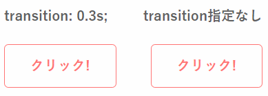

# CSS基礎問題集
Overview_CSS.mdに準じた問題集です。この問題集では、作成してもらうものの仕様書を最初に提示し、全く同じものを作る練習をしてもらいます。基本的に出題範囲に書かれた部分を読めばコードを書けるようになっています。また、ヒントとして考え方を掲載しています。作り方が分からない場合は必要に応じてこちらを見ることをお勧めします。また、難易度が基本、普通、応用に分かれているので注意してください。特に応用においては考え方に新しく学ぶことを書いている場合が多いので、積極的に見ていきましょう。

コードの書き方は一通りではないこと、そしてコードの書き方を指導するという目的からこの問題集には解答を掲載していません。書いたコードはSlackの#web-questionsチャンネルへアップロードし皆と共有しましょう。そのため、この問題集では内部参照を用いてCSSを書くことでHTMLファイルのみでHTMLとCSSを確認できるようにしてください。HTMLの最後にCSSを`<style></style>`で囲むことで内部参照することができます。

また、以下の例全てにおいてフォントを`Yu Gothic`にしてください。次のように書けば反映されます。`font-family: "Yu Gothic";`

## Q1.【基本】見出し1

以下の仕様書にしたがって見出しを作成してください。


**出題範囲**  
[3-1　重要だが詳しく取り上げる必要のないプロパティ一覧](Overview_CSS.md#3-1)  
[3-2　重要プロパティ①　`border` / `padding` / `margin`](Overview_CSS.md)  
[C-2　テキストの上下左右中央揃え](Overview_CSS.md#c-2)

<details><summary>考え方</summary><div>

見出しの背景が青い部分と灰色の部分に分かれていますね。背景色を灰色とすれば良さそうなのは明らかです。では青い部分をどのようにして作り出せばよいでしょうか。もう一つの問題は灰色の部分の左端と見出しまでが`30px`空いていることです。ここで[3-2　重要プロパティ①　`border` / `padding` / `margin`](Overview_CSS.md#3-2) で取り上げた例を良く見てもらうと分かりますが、要素の背景色はコンテンツ領域と`padding`にのみ適用されます。`margin`には適用されないことを覚えておきましょう。それを踏まえるとこの`30px`の余白には背景色の灰色を適用させたいのですから`padding`でとるのが良いということになります。ここまで来れば[3-2　重要プロパティ①　`border` / `padding` / `margin`](Overview_CSS.md#3-2) の最後に載せた図から青い部分を何で作ればよいか分かるのではないでしょうか。

</div></details>

## Q2.【応用】見出し2

以下の仕様書にしたがって見出しを作成してください。


**出題範囲**  
[3-1　重要だが詳しく取り上げる必要のないプロパティ一覧](Overview_CSS.md#3-1)  
[3-2　重要プロパティ①　`border` / `padding` / `margin`](Overview_CSS.md#3-2)  
[5　疑似要素](Overview_CSS.md#5)

<details><summary>考え方</summary><div>

この問題では見出し全体の`height`が指定されていないので高さを考える必要がありません。それはつまり下の余白`15px`だけ設けてあげれば、見出し1のように上下中央揃えをする必要が無いということです。そして、一番の問題点は線が２色に分かれていることです。こういった線を引くには`border-bottom`を使用すれば良さそうなのはすぐに分かると思います。でも残念ながら２色に分けることはできません。そこで、以下のようにして灰色の`border`とは別に水色の線を疑似要素で用意し、それを重ねることで上記のデザインを実現します。


ところが、今まで学んだだけでは疑似要素でどのようにこのような直線を作ればいいか分かりにくいのではないでしょうか。画像を追加するには`content`プロパティに画像のURLを入れれば良いのでした。  
`content: url("accent.png");`  
文字を入れたい場合は以下のようにダブルクオーテーション`""`の中に表示させたい文字を入れます。  
`content: "理工展";`  
今回は何も表示させなくていいので文字を入れなければOKです。  
`content: "";`  
ではどうやってこの直線を作るかというと、単に`height`と`width`を指定して長方形を作り、`background-color`を指定された色にするだけです。絶対配置(`position: absolute;`)で灰色の線と重なるようにする部分は自分で試してみましょう。

</div></details>

## Q3.【普通】ボタン（ホバーエフェクト付き）

以下の仕様書にしたがってボタンを作成してください。


**出題範囲**  
[3-1　重要だが詳しく取り上げる必要のないプロパティ一覧](Overview_CSS.md#3-1)  
[3-2　重要プロパティ①　`border` / `padding` / `margin`](Overview_CSS.md#3-2)  
[4　疑似クラス](Overview_CSS.md#4)


今回はいままで紹介してこなかった`button`要素を使ってみましょう。以下のようにHTMLに書いてみるとこのようなボタンが出現します。

```html
<button>クリック！</button>
```


`button`要素は自由に大きさを変えられますし、自動的に文字が中央に表示されます。最初からある程度CSSが適用されているので、変更したい部分は上書きしないといけないので気を付けましょう。また、仕様書にトランジションと書いてあるのが分かりますでしょうか。これはCSSプロパティが変化する際のアニメーションの速度を変更できるプロパティです。実際に下の例を見てみると、`transition: 0.3s;`と指定した方は0.3秒かけて`:hover`に書かれた状態まで遷移していることが分かります。これはトランジションさせたい要素に記述する（:hoverに書くのではない）ことで全ての変化が時間をかけて遷移するようになります。



ちなみにこのようなホバーエフェクトというのはネット上で大量に紹介されているので、気に入ったものを見つけた際にはコピペしてしまいましょう。

## Q4. 【応用】要素のくくり方　<a id="Q4"></a>

以下の仕様書にしたがってレイアウトを作成してください。


**コピペ用文章**
```
四谷大塚の算数の問題文によく登場するので見かけた際はよろしくお願いします。
昔は成績優秀者のうち実名掲載を拒否すると僕の名前で掲載されていました。ところが、四谷太郎、大塚花子がたくさんあると分かりづらい為、実名不可の場合は自分で決めたペンネームで掲載されるようになりました。出番が少なくなったので少し寂しいです。
```

**出題範囲**  
[3-1　重要だが詳しく取り上げる必要のないプロパティ一覧](Overview_CSS.md#3-1)  
[3-2　重要プロパティ①　`border` / `padding` / `margin`](Overview_CSS.md#3-2)  
[3-5　重要プロパティ④　`flex`](Overview_CSS.md#3-5)

<details><summary>考え方</summary><div>

webページを作るにあたって、どのように要素をくくってCSSを適用させるかを設計することは非常に重要です。こうすれば作れるだろうという算段をつけてから制作を開始することで失敗が少なくなります。slackのメッセージが要素のくくり方を学ぶのにうってつけであったので、今回はこれを例として上げました。

この問題では重要なことを思い出す必要があります。それはインライン要素とブロック要素の違いです。インライン要素は改行されないので続けて書くと横に並びます。一方、ブロック要素は改行されるのでそのままでは横に並びません。これを念頭にどのようにHTMLを記述するべきか考えます。

まずは大きいくくりから見ましょう。緑色の四角とメッセージの詳細（名前・時間・本文）が並列に並んでいるのが分かりますよね。ここで、とりあえず緑色の四角と名前を並列に並べようと考えてはいけません。なぜなら緑色の四角とメッセージ本文も名前と同様に並列に並んでいるからです。仮に緑色の四角と名前だけを並列に並べると、メッセージ本文は四角の下に表示されてしまいます。ですので、最初に大きいくくりで要素をブロック分けするのが重要なのです。そして四角とメッセージの詳細どちらも`div`で作ろうとすれば、これらはブロック要素ですから横に並べるには`flex`を用いるという判断になります。

次にメッセージの詳細をどうやって作るかを考えましょう。これは名前および時間と本文で縦に分かれることが分かるでしょうか。縦に並べるだけですからどちらも`div`で囲ってしまえばこの通りに表示されるはずです。

最後に名前と時間の部分。これも`flex`を使えば良いとお思いでしょうか。そんな必要はありません。なぜならどちらも`span`で囲ってしまえばおしまいだからです。`span`はインライン要素ですから自動的に横幅は文字幅になり、二つ並べて記述すれば横に並んでくれます。高さや横幅指定する必要が無いのですからわざわざブロック要素の`div`を使う必要はないのです。

さて、今まで述べたことを下の図にまとめておきます。くくり方に絶対的な正解があるわけではないですが、楽に実装できるか煩雑になるかがかなり左右されるので是非ともうまいくくり方を出来るようにしておきましょう。


</div></details>
